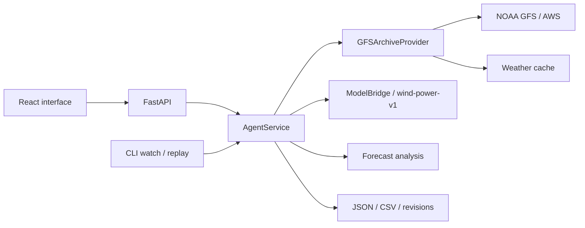

# JelAI — Agentic AI for Wind Farm Generation Forecasting

[Қазақша](README.md) · [Русский](README.ru.md) · **English**

**HackAlem AI · Energy track · Samruk-Kazyna case.**

**The project name is JelAI.** The case title in the task brief is “Agentic AI for Wind Farm Generation Forecasting.”

JelAI combines “jel” (the Kazakh word for wind) and AI. The project forecasts the **normalized active power of two wind turbines for the next 24 or 48 hours**.

## Overview

Wind farm generation depends on the weather. JelAI enables an operator or energy analyst to obtain an hourly generation forecast using weather forecasts that were available at a particular point in time, and to inspect the data behind the calculation.

The project is designed to replay February 2026 in historical mode: the agent retrieves weather from the NOAA GFS archive, checks time constraints, runs the saved ML model, and presents the result through a chart, table, CSV, and verifiable metadata. The output unit is `normalized_power`; it must not be interpreted as MW or MWh.

## Implemented features

- **24/48-hour forecasts:** select both turbines together or either turbine separately.
- **Trilingual web interface:** Kazakh, Russian, and English; the language preference is saved in the browser. Includes a chart, hourly table, UTC/Almaty display time zones, and CSV downloads.
- **Real archived weather:** NOAA GFS retrieval, a local cache, SHA256 checksums, and source metadata.
- **Complete agent cycle:** fetch weather → validate data → run the model → analyse the result → save. Stages and errors are recorded in the log.
- **Agent analysis:** minimum, maximum, mean, largest hourly change, wind speed range, constant-forecast detection, and revision comparisons. Recommendations do not change the numerical forecasts.
- **Revisions:** identical inputs retain the ID and revision; changed inputs that meet the time constraints create a new revision.
- **Automatic updates:** the CLI `watch` mode rechecks inputs at a specified interval, with retries, delays after errors, and a single-process ownership lock.
- **Model evaluation:** tuning, independent holdout, and the final refitted model are shown separately; the report's association with the model package is checked.
- **Completed February results:** 29 forecast issues, 2 784 records across the full 48-hour forecasts; **1 344 records selected for February, 672 hours per turbine**, with no missing hours. This result is recorded in the [repository's verification report](docs/evidence/february-replay.json).

Ready-to-use files: [February forecast, CSV](outputs/forecast/february-2026-48h.csv) · [February forecast, JSON](outputs/forecast/february-2026-48h.json).

## How it works

1. The user selects **API** mode, the forecast issue date and UTC time, the turbines, and a 24/48-hour horizon.
2. FastAPI accepts the calculation job and returns a `run_id`. The interface polls its progress.
3. Using the turbine coordinates, the agent selects weather from the GFS archive that was available by the issue time. Data that became available later is excluded from the historical forecast.
4. After the data and training cutoff are checked, the saved `wind-power-v1` model calculates hourly predictions for each turbine. The model is not retrained for each request.
5. The agent analyses the forecast and saves the report, warnings, and revision. The interface displays the chart, table, agent analysis, source information, and model evaluation.
6. The user can download a CSV. The interface checks that the export matches the displayed JSON result.

`valid_time` marks the **end** of a one-hour interval. For example, `19:00 UTC` refers to the mean power over `[18:00, 19:00)`; the first forecast lead is `+1 hour`.

## Technology

| Layer | Technologies used in the repository |
| --- | --- |
| Backend and agent | Python 3.11, FastAPI, Pydantic, Uvicorn, HTTPX |
| Data and ML | pandas, NumPy, SciPy, scikit-learn, joblib |
| Main ML model | A separate histogram gradient boosting model for each turbine; selected configuration: `hgb_medium` |
| Baseline models | Constant mean and the wind-speed-based `wind_curve` |
| Main interface | TypeScript, React, Vite, Recharts, Lucide React |
| Alternative interface | Streamlit, Plotly |
| Weather processing | ECMWF ecCodes, NOAA GFS 0.25° archive, AWS Open Data |
| Verification | pytest, Ruff, Vitest, Testing Library; GitHub Actions workflow configuration |

Dependencies are listed in [pyproject.toml](pyproject.toml), [ui/requirements.txt](ui/requirements.txt), [package.json](ui/web/package.json), and [package-lock.json](ui/web/package-lock.json).

**OpenAI and other LLM APIs are not involved in the current numerical training or forecasting. No API key or paid subscription is required.** Agent analysis and next-action recommendations are calculated using rules in the code.

## Project architecture



| Location | Purpose |
| --- | --- |
| `src/wind_agent/data/` | Validate the original SCADA files and prepare complete hourly training data |
| `src/wind_agent/weather/` | Select, retrieve, and validate archived weather |
| `src/wind_agent/model/`, `src/wind_agent/evaluation/` | ML model, experiments, and evaluation over time |
| `src/wind_agent/agent/` | Orchestration, analysis, automatic updates, storage, and revisions |
| `src/wind_agent/api/`, `src/wind_agent/cli.py` | HTTP API and command-line interface |
| `ui/web/` | Main JelAI React interface |
| `ui/app.py` | Alternative Streamlit interface |
| `models/wind-power-v1/` | Saved weights, metadata, and evaluation report |
| `config/`, `outputs/forecast/`, `docs/evidence/` | Configurations, completed results, and verification reports |

Local calculations and the cache are written to `artifacts/`, which is excluded from Git. The main API uses `artifacts/live`. Only one backend process should use a given artifact directory.

## Installation and startup

### 1. Prerequisites and repository

Use Git, **Python 3.11**, **Node.js 24.14.0**, and **npm 11.9.0**. An internet connection is needed for installation and the initial download of real weather data. Retraining is not required for the main demonstration: the saved model is included in the repository.

```sh
git clone https://github.com/BAITC-Hacks/hack-7ea5e17b-edubridge.git
cd hack-7ea5e17b-edubridge
```

### 2. Backend — first terminal

From the repository root on **macOS/Linux**:

```sh
python3.11 -m venv .venv
.venv/bin/python -m pip install -e '.[dev,weather,model]' -r ui/requirements.txt
.venv/bin/python -m wind_agent --config config/archive-model.json serve
```

Equivalent commands for **Windows PowerShell**:

```powershell
py -3.11 -m venv .venv
.\.venv\Scripts\python.exe -m pip install -e ".[dev,weather,model]" -r ui/requirements.txt
.\.venv\Scripts\python.exe -m wind_agent --config config/archive-model.json serve
```

Activating the virtual environment is optional. The `weather` extra installs ecCodes, `model` installs the model dependencies, and `dev` installs the test tools; `ui/requirements.txt` is needed for the alternative interface and its tests.

- API: <http://127.0.0.1:8000>
- Service health: <http://127.0.0.1:8000/health>
- Swagger: <http://127.0.0.1:8000/docs>

### 3. Main React interface — second terminal

In a new terminal, from the repository root:

```sh
cd ui/web
npm ci
npm run dev
```

Website: **<http://127.0.0.1:5173>**. The default language is Russian; select **English** in the top bar.

**Quick demo:** to check only the interface, skip step 2 and complete steps 1 and 3. The default **Demo** mode works with synthetic data without a backend. It is not a real model result or a measure of accuracy. For a real forecast, start the backend and switch to **API** mode.

Vite forwards `/api` requests to `http://127.0.0.1:8000`. If the API uses a different port, add, for example, `WIND_API_TARGET=http://127.0.0.1:8001` to `ui/web/.env.local` and restart Vite. The selected port must be free. Stop the services with `Ctrl+C` in each terminal.

### 4. Additional run modes

Run the following Python commands from the repository root. On Windows, replace `.venv/bin/python` with `.\.venv\Scripts\python.exe`.

**Demonstrate automatic historical updates:** the agent calculates two historical issues in sequence without waiting for a day to pass.

```sh
.venv/bin/python -m wind_agent --config config/monitor-model.json watch --start-issue 2026-01-31T18:00:00Z --end-issue 2026-02-01T18:00:00Z --step-hours 24 --horizon-hours 48
```

Continuous mode: `watch --interval-seconds 60`. `watch` uses a separate `monitor-jobs` directory. Because its time state is persisted, returning to an earlier historical time requires a separate `artifact_dir`. Full instructions: [automatic updates](docs/agent-monitor.md).

**Replay all of February:** this lengthy step is not required to view the completed CSV. Downloading without a cache requires several GB of disk space and network traffic.

```sh
.venv/bin/python -m wind_agent --config config/replay-february.json replay --horizon-hours 48
```

This configuration uses a storage directory separate from the API. Results: `artifacts/february-integration/archive/replay/2026-02-48h/report.json` and `february.json`. To reproduce the audit and CSV/JSON exports, see the [replay instructions](docs/replay-validation.md).

**Alternative Streamlit interface:** after stopping the React/API processes, you can run `.venv/bin/python scripts/run_app.py`. This command starts the API and Streamlit together; the interface is at <http://127.0.0.1:8501>. It does not start the React interface.

## How to verify the solution

### Main judging scenario

1. Start the backend and React using the instructions above. Open <http://127.0.0.1:5173> and select **English → API**.
2. In **Connection settings**, keep the `/api` address and click **Check**. The `/health` response should contain `mode=archive`, `is_demo=false`, `model_ready=true`, and `weather_ready=true`.
3. **Issue date:** `2026-01-31`; **Time, UTC:** `18:00`; **Turbines:** “Both turbines”; **Horizon:** `48 h`.
4. Click **Calculate forecast**. The first request downloads weather data and may take several minutes. The completed status is `completed` / “Calculation complete”.
5. Expect **96 values**: 48 hours × 2 turbines. The time range is `2026-01-31T19:00:00Z` … `2026-02-02T18:00:00Z`; the unit is `normalized_power`. Completeness in the chart and table does not establish model accuracy.
6. Inspect **Source and quality**, **Model evaluation**, and **Agent analysis**. They show the GFS issue, model version, training cutoff, and warnings. A `review_required` recommendation may be due to input assumptions; it does not mean the calculation failed.
7. Save the result with **Download CSV**. Check that changing the language preserves the calculated result.
8. When you run the same parameters again, the ID and revision are retained if the inputs are unchanged. Selecting `24 h` and one turbine should produce **24 records**.

If the weather or model is unavailable, the API reports an error; the system does not silently substitute demo data or zeros for a real forecast. Use the exact time above for the first check: the saved model's training cutoff does not allow an earlier forecast issue.

### Verification through the API

Submit this JSON to `POST /runs` in Swagger:

```json
{
  "issue_time": "2026-01-31T18:00:00Z",
  "horizon_hours": 48,
  "turbine_ids": ["turbine_1", "turbine_2"]
}
```

| Request | Expected function |
| --- | --- |
| `POST /runs` | `202` and a `run_id`; calculation runs in the background |
| `GET /runs/{run_id}` | Status, revision, and log; poll until `completed` |
| `GET /runs/{run_id}/forecast` | Hourly forecast records as JSON |
| `GET /runs/{run_id}/forecast.csv` | The same forecast as CSV |
| `GET /runs/{run_id}/analysis` | Agent analysis for the current revision |
| `GET /evaluation` | An evaluation report associated with the saved model package |

[API contract](docs/api-contract.md) · [Model evaluation API](docs/evaluation-api.md) · [Agent analysis](docs/forecast-analysis.md).

### Automated tests

Backend tests, from the repository root:

```sh
.venv/bin/python -m pytest -q
.venv/bin/python -m pip check
```

Frontend tests and build, in a separate terminal from the repository root:

```sh
cd ui/web
npm test
npm run build
```

To open the built interface at <http://127.0.0.1:4173>, run `npm run preview` from `ui/web`.

Run a separate real HTTP/model integration check:

```sh
.venv/bin/python scripts/verify_app_integration.py --base-url http://127.0.0.1:8000 --timeout-seconds 300
```

This check covers all six combinations of turbine selection and 24/48-hour horizons, repeated requests, and JSON/CSV consistency. The backend must be running; the network is used when the cache is unavailable.

Verification evidence in the repository: [backend and monitor](docs/evidence/agent-platform-checks.json), [React and the real API](docs/evidence/agent-ui-validation.json), [February replay](docs/evidence/february-replay.json). The numbers in these files are the results recorded in those reports; the commands above produce results for a new environment. GitHub Actions is configured, but the [saved report](docs/evidence/agent-platform-checks.json) states that CI did not start because of a billing issue; this is not presented as a successful CI run.

## Data and integrations

**Historical SCADA:** the organizer supplied the [turbine 1 CSV](https://drive.google.com/file/d/1hubNF3tgc7DbgXxHLpIF6zIBHtvMyzLX/view) and [turbine 2 CSV](https://drive.google.com/file/d/1_WTrYhZ3-71A9IpkBb9RHPN7ncVaupBk/view). The original files are not committed to Git; the loader verifies them against fixed SHA256 checksums. The mean of six complete 10-minute measurements forms one hourly training target. Incomplete hours are not filled with zeros. Data preparation: [DATA_PREPARATION.md](docs/DATA_PREPARATION.md).

**Weather:** the NOAA GFS 0.25° archive is accessed through AWS Open Data. Model inputs are wind speed at 100 m and temperature at 2 m. Future measured SCADA weather is not substituted for archived forecasts. Availability at the issue time is assessed using the S3 `LastModified` metadata of every required GRIB and index object. Source policy: [weather-source.md](docs/weather-source.md).

**Model:** weights and metadata are in [models/wind-power-v1/](models/wind-power-v1/). Obtaining a forecast does not require downloading the original SCADA data again or retraining the model. To reproduce training in full, see [MODEL_REPRODUCIBILITY.md](docs/MODEL_REPRODUCIBILITY.md).

**Evaluation results:** the errors below are in `normalized_power` units; lower is better.

| Model | Tuning MAE | Independent holdout MAE |
| --- | ---: | ---: |
| Selected `hgb_medium` | 0.232464 | 0.226919 |
| Simple `wind_curve` | 0.248695 | 0.209460 |

The simple wind curve has a lower error on the holdout period. The model was selected using the predefined tuning criterion; the winner was not reselected based on the holdout results. Full evidence: [model card](docs/model-card.md), [validation.json](models/wind-power-v1/validation.json).

## Limitations

- **Actual February generation data is unavailable.** Completing the February replay does not establish forecast accuracy; February MAE/RMSE values are not reported.
- **The power normalization formula and turbine rated capacities are unconfirmed.** Results are not converted to MW/MWh or summed as station power.
- **SCADA time conventions are assumptions:** fixed UTC+5, timestamps at the start of each 10-minute interval, and zero reporting delay. The data owner needs to confirm these.
- **January holdout is not an independent evaluation of the final production model.** The final model was refitted on January data, including holdout; its cutoff is `2026-01-31T18:00:00Z`.
- **GFS spatial resolution is limited:** both turbines fall in the same `43.75, 78.5` grid cell. Weather values at the end of the hour are used to predict hourly mean power.
- **The archive availability policy does not fully establish NOAA's original publication time.** Today's retrieval time is not used as historical availability.
- **Calibrated uncertainty intervals are unavailable.** Maintenance, curtailment, and shutdowns are not modelled separately. Agent recommendations do not automatically control equipment.
- **Long-term continuous operation has not been demonstrated.** The monitor's historical check used accelerated time; it does not guarantee performance in future seasons.
- **The current version is intended for local demonstration:** user authorization and role-based access are not implemented. Unknown service diagnostics and original JSON/CSV technical fields may remain in their source language.

## Deployed version

**The repository does not specify a public deployment URL.** Judges can verify the project by cloning it from GitHub and running it locally.

Main local interface: <http://127.0.0.1:5173>. This is not a publicly hosted website. If `ui/web/dist` is deployed in the future, HTTPS and `/api` → backend routing must be configured separately; Vite's dev/preview proxy is not included in the static build.
