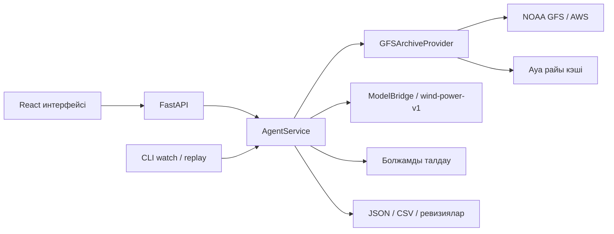
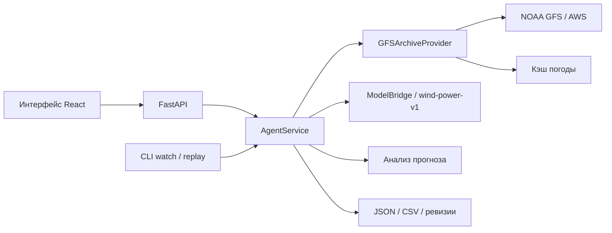
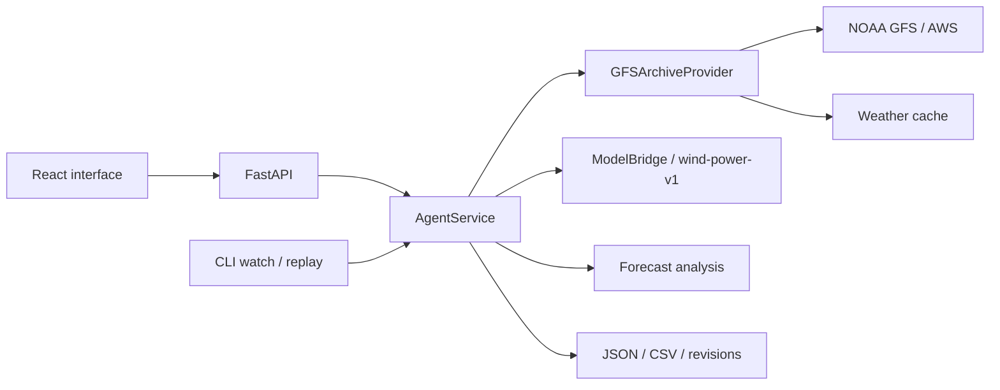

# JelAI

[Қазақша](#kazakh) · [Русский](#russian) · [English](#english)

<a id="kazakh"></a>

## Қазақша

### JelAI — жел электр станциясының өндірісін болжауға арналған Agentic AI жүйесі

**HackAlem AI · «Энергетика» трегі · «Самұрық-Қазына» кейсі.**

**Жоба атауы — JelAI.** ТЗ-дағы кейс атауы — «ЖЭС өндірісін болжауға арналған Agentic AI».

JelAI атауы «жел» және AI сөздерінен құралған. Жоба екі жел турбинасының алдағы **24 немесе 48 сағаттағы нормаланған белсенді қуатын** болжайды.

### Қысқаша сипаттама

Жел электр станциясының өндірісі ауа райына тәуелді. JelAI операторға немесе энергетика талдаушысына белгілі бір уақыт сәтінде қолжетімді болған ауа райы болжамын пайдаланып, сағаттық өндіріс болжамын алуға және оның қай деректерден есептелгенін тексеруге мүмкіндік береді.

Жоба 2026 жылғы ақпанды тарихи режимде қайта есептеуге арналған: агент NOAA GFS архивінен ауа райын алады, уақыттық шектеулерді тексереді, сақталған ML моделін іске қосады және нәтижені график, кесте, CSV мен тексерілетін метадеректер арқылы ұсынады. Нәтиженің өлшем бірлігі — `normalized_power`; оны МВт немесе МВт·сағ деп түсіндіруге болмайды.

### Не іске асырылды

- **24/48 сағаттық болжам:** екі турбинаны бірге немесе әрқайсысын бөлек таңдау.
- **Үштілді веб-интерфейс:** қазақша, орысша, ағылшынша; тіл таңдауы браузерде сақталады. График, сағаттық кесте, UTC/Алматы уақыт белдеуі және CSV жүктеу бар.
- **Нақты архивтік ауа райы:** NOAA GFS жүктеу, жергілікті кэш, SHA256 бақылау қосындылары және дереккөз метадеректері.
- **Агенттің толық циклі:** ауа райын алу → деректерді тексеру → модель → нәтижені талдау → сақтау. Кезеңдер мен қателер журналға жазылады.
- **Агент талдауы:** минимум, максимум, орташа мән, сағаттар арасындағы ең үлкен өзгеріс, жел жылдамдығының аралығы, тұрақты болжамды белгілеу және ревизияларды салыстыру. Ұсыныс болжамның сандық мәндерін өзгертпейді.
- **Ревизиялар:** бірдей кіріс үшін ID мен ревизия сақталады; өзгерген, уақыт талабына сай кіріс жаңа ревизия туғызады.
- **Автоматты жаңарту:** CLI-дегі `watch` режимі деректерді берілген аралықпен қайта тексереді; қайталау, қате кезіндегі кідіріс және бір процесс иелігін бекіту қарастырылған.
- **Модельді бағалау:** tuning, тәуелсіз holdout және соңғы қайта оқытылған модель бөлек көрсетіледі; есептің модель пакетімен байланысы тексеріледі.
- **Дайын ақпан нәтижесі:** 29 шығарылым, толық 48 сағаттық болжамдарда 2 784 жазба; ақпанға таңдалған **1 344 жазба, әр турбинаға 672 сағат**, өткізіп алған сағат жоқ. Бұл нәтиже [репозиторийдегі тексеру хаттамасында](docs/evidence/february-replay.json) тіркелген.

Дайын файлдар: [ақпан болжамы, CSV](outputs/forecast/february-2026-48h.csv) · [ақпан болжамы, JSON](outputs/forecast/february-2026-48h.json).

### Шешім қалай жұмыс істейді

1. Пайдаланушы **API** режимін, болжам шығарылатын күн мен UTC уақытын, турбиналарды және 24/48 сағаттық аралықты таңдайды.
2. FastAPI есептеу тапсырмасын қабылдап, `run_id` қайтарады. Интерфейс орындалу күйін сұрап отырады.
3. Агент турбиналардың координаталары бойынша GFS архивінен сол шығарылым сәтіне дейін қолжетімді болған ауа райын таңдайды. Кейін қолжетімді болған дерек тарихи болжамға кірмейді.
4. Деректер мен оқыту шегі тексеріліп, дайын `wind-power-v1` моделі әр турбинаға сағаттық болжам есептейді. Әр сұрауда модель қайта оқытылмайды.
5. Агент болжамды талдап, есепті, ескертулерді және ревизияны сақтайды. Интерфейс графикті, кестені, агент талдауын, дереккөзді және модель бағасын көрсетеді.
6. Пайдаланушы CSV жүктей алады. Интерфейс экспорттың көрсетілген JSON нәтижесіне сәйкестігін тексереді.

`valid_time` — бір сағаттық аралықтың **соңы**. Мысалы, `19:00 UTC` мәні `[18:00, 19:00)` аралығындағы орташа қуатқа қатысты; бірінші болжам қадамы — `+1 сағат`.

### Технологиялар

| Қабат | Репозиторийде қолданылған технологиялар |
| --- | --- |
| Backend және агент | Python 3.11, FastAPI, Pydantic, Uvicorn, HTTPX |
| Деректер мен ML | pandas, NumPy, SciPy, scikit-learn, joblib |
| Негізгі ML моделі | Әр турбинаға жеке histogram gradient boosting моделі, таңдалған конфигурация — `hgb_medium` |
| Салыстыру модельдері | Орташа тұрақты мән және жел жылдамдығына негізделген `wind_curve` |
| Негізгі интерфейс | TypeScript, React, Vite, Recharts, Lucide React |
| Балама интерфейс | Streamlit, Plotly |
| Ауа райын өңдеу | ECMWF ecCodes, NOAA GFS 0.25° архиві, AWS Open Data |
| Тексеру | pytest, Ruff, Vitest, Testing Library; GitHub Actions workflow конфигурациясы |

Тәуелділіктер [pyproject.toml](pyproject.toml), [ui/requirements.txt](ui/requirements.txt), [package.json](ui/web/package.json) және [package-lock.json](ui/web/package-lock.json) файлдарында көрсетілген.

**OpenAI немесе басқа LLM API-і ағымдағы сандық оқыту мен болжамға қатыспайды. API кілті және ақылы жазылым қажет емес.** Агенттің талдауы мен келесі әрекет ұсынысы кодтағы ережелер арқылы есептеледі.

### Жоба архитектурасы



| Орналасуы | Міндеті |
| --- | --- |
| `src/wind_agent/data/` | Бастапқы SCADA файлдарын тексеру, толық сағаттық оқыту деректерін дайындау |
| `src/wind_agent/weather/` | Архивтік ауа райын таңдау, жүктеу және тексеру |
| `src/wind_agent/model/`, `src/wind_agent/evaluation/` | ML моделі, эксперименттер, уақыт бойынша бағалау |
| `src/wind_agent/agent/` | Оркестрация, талдау, автоматты жаңарту, сақтау және ревизиялар |
| `src/wind_agent/api/`, `src/wind_agent/cli.py` | HTTP API және командалық интерфейс |
| `ui/web/` | Негізгі JelAI React интерфейсі |
| `ui/app.py` | Балама Streamlit интерфейсі |
| `models/wind-power-v1/` | Дайын салмақтар, метадеректер және бағалау есебі |
| `config/`, `outputs/forecast/`, `docs/evidence/` | Конфигурациялар, дайын нәтижелер және тексеру хаттамалары |

Жергілікті есептеулер мен кэш `artifacts/` каталогына жазылады; ол Git-ке кірмейді. Негізгі API `artifacts/live` каталогын пайдаланады. Бір артефакт каталогымен бір ғана backend процессі жұмыс істеуі керек.

### Орнату және іске қосу

#### 1. Қажетті орта және репозиторий

Git, **Python 3.11**, **Node.js 24.14.0** және **npm 11.9.0** қолданыңыз. Орнатуға және нақты ауа райын алғаш жүктеуге интернет керек. Қайта оқыту негізгі демонстрация үшін қажет емес: дайын модель репозиторийде бар.

```sh
git clone https://github.com/BAITC-Hacks/hack-7ea5e17b-edubridge.git
cd hack-7ea5e17b-edubridge
```

#### 2. Backend — бірінші терминал

Репозиторий түбірінде, **macOS/Linux**:

```sh
python3.11 -m venv .venv
.venv/bin/python -m pip install -e '.[dev,weather,model]' -r ui/requirements.txt
.venv/bin/python -m wind_agent --config config/archive-model.json serve
```

**Windows PowerShell** үшін баламасы:

```powershell
py -3.11 -m venv .venv
.\.venv\Scripts\python.exe -m pip install -e ".[dev,weather,model]" -r ui/requirements.txt
.\.venv\Scripts\python.exe -m wind_agent --config config/archive-model.json serve
```

Виртуалды ортаны белсендіру міндетті емес. `weather` қосымшасы ecCodes-ты, `model` модель тәуелділіктерін, `dev` тест құралдарын орнатады; `ui/requirements.txt` балама интерфейс пен оның тесттеріне керек.

[.env.example](.env.example) — құпия кілттері жоқ баптау үлгісі. Backend `.env` файлын автоматты түрде оқымайды: осы нұсқаулықтағы `--config` параметрін немесе процесс ортасындағы `WIND_AGENT_CONFIG` айнымалысын пайдаланыңыз. Нақты `.env` және `ui/web/.env.local` Git-ке қосылмайды.

- API: <http://127.0.0.1:8000>
- Қызмет күйі: <http://127.0.0.1:8000/health>
- Swagger: <http://127.0.0.1:8000/docs>

#### 3. Негізгі React интерфейсі — екінші терминал

Жаңа терминалда репозиторий түбірінен:

```sh
cd ui/web
npm ci
npm run dev
```

Сайт: **<http://127.0.0.1:5173>**. Әдепкі тіл — орысша; жоғарғы панельден **Қазақша** таңдауға болады.

**Жылдам демо:** тек интерфейсті тексеру үшін 2-қадамды өткізіп, 1 және 3-қадамдарды орындаңыз. Әдепкі **Демо** режимі backend-сіз синтетикалық деректермен жұмыс істейді. Ол нақты модель нәтижесі немесе дәлдік көрсеткіші емес. Нақты болжам үшін backend-ті қосып, **API** режиміне ауысыңыз.

`/api` сұрауларын Vite `http://127.0.0.1:8000` адресіне бағыттайды. API порты өзгеше болса, `ui/web/.env.local` файлына, мысалы, `WIND_API_TARGET=http://127.0.0.1:8001` жазып, Vite-ты қайта қосыңыз. Таңдалған порт бос болуы керек. Сервистерді тоқтату — әр терминалда `Ctrl+C`.

#### 4. Қосымша іске қосу режимдері

Төмендегі Python командалары репозиторий түбірінен орындалады. Windows-та `.venv/bin/python` орнына `.\.venv\Scripts\python.exe` пайдаланыңыз.

**Автоматты тарихи жаңартуды көрсету:** агент екі тарихи шығарылымды өзі ретімен есептейді, тәуліктің өтуін күтпейді.

```sh
.venv/bin/python -m wind_agent --config config/monitor-model.json watch --start-issue 2026-01-31T18:00:00Z --end-issue 2026-02-01T18:00:00Z --step-hours 24 --horizon-hours 48
```

Үздіксіз режим: `watch --interval-seconds 60`. `watch` бөлек `monitor-jobs` каталогын қолданады. Уақыт күйі сақталатындықтан, бұрынғы тарихи уақытқа оралу үшін бөлек `artifact_dir` қажет. Толық нұсқаулық: [автоматты жаңарту](docs/agent-monitor.md).

**Қазыларға көрсету:** таза monitor каталогында жоғарыдағы команданы іске қосып, `artifacts/agent-monitor/monitor-jobs/archive/monitor/last_session.json` ішінен `status=completed`, `completed_runs=2` мәндерін және әр шығарылымның 96 жазбасын тексеріңіз. [Бұрынғы нақты архив тексеруі](docs/evidence/agent-monitor-integration.json) алғашқы есептеуді, өзгермеген кірістің сақталуын және жаңа шығарылымды растайды. [Жаңа бақыланатын тексеру](docs/evidence/controlled-real-revision.json) бір `issue_time` үшін сол сәтте қолжетімді ескі NOAA шығарылымынан ең соңғы жарамды шығарылымға әдейі ауысады: бір ID ішінде `1 → 1 → 2` расталды, 48 болжамның 48-і өзгерді. Ауа райы мен қуат мәндері қолдан жасалмаған; бұл табиғи нақты уақыттағы дерек келуін немесе болжам дәлдігін дәлелдемейді.

Оны қайталау үшін жаңа немесе бос output каталогын пайдаланыңыз (`--offline` тек қажетті ауа райы толық кэштелгенде):

```sh
.venv/bin/python scripts/verify_real_revision.py --cache artifacts/weather-cache --output artifacts/controlled-revision-check
```

**Ақпанды толық қайта есептеу:** дайын CSV-ді қарау үшін бұл ұзақ қадамды орындау міндетті емес. Кэшсіз жүктеу бірнеше GB орын мен трафикті талап етеді.

```sh
.venv/bin/python -m wind_agent --config config/replay-february.json replay --horizon-hours 48
```

Бұл конфигурация API-ден бөлек сақтау каталогын қолданады. Нәтиже: `artifacts/february-integration/archive/replay/2026-02-48h/report.json` және `february.json`. Аудит пен CSV/JSON экспортын қайта жасау: [replay нұсқаулығы](docs/replay-validation.md).

**Балама Streamlit интерфейсі:** React/API процестерін тоқтатқаннан кейін `.venv/bin/python scripts/run_app.py` орындауға болады. Бұл команда API мен Streamlit-ті бірге іске қосады; интерфейс адресі — <http://127.0.0.1:8501>. Ол React интерфейсін іске қоспайды.

### Шешімді қалай тексеруге болады

#### Қазыларға арналған негізгі сценарий

1. Жоғарыдағы нұсқаулықпен backend пен React-ты іске қосыңыз. <http://127.0.0.1:5173> адресін ашып, **Қазақша → API** таңдаңыз.
2. **Қосылым баптаулары** ішінде `/api` адресін қалдырып, **Тексеру** батырмасын басыңыз. `/health` жауабында `mode=archive`, `is_demo=false`, `model_ready=true`, `weather_ready=true` күтіледі.
3. **Шығарылым күні:** `2026-01-31`; **Уақыт, UTC:** `18:00`; **Турбиналар:** «Екі турбина»; **Болжам аралығы:** `48 сағ`.
4. **Болжамды есептеу** батырмасын басыңыз. Бірінші сұрауда ауа райы жүктеледі, сондықтан бірнеше минут кетуі мүмкін. Аяқталған күй — `completed` / «Есептеу аяқталды».
5. **96 мән** күтіледі: 48 сағат × 2 турбина. Уақыт аралығы — `2026-01-31T19:00:00Z` … `2026-02-02T18:00:00Z`; өлшем бірлігі — `normalized_power`. График пен кестедегі толымдылық модель дәлдігін білдірмейді.
6. **Дереккөз және сапа**, **Модельді бағалау**, **Агент талдауы** бөлімдерін қараңыз. Толық талдаудағы `methodology_warnings` уақыт жорамалдары мен калибрленбеген интервалдар сияқты ғылыми шектеулерді сақтайды; `review_warnings` нақты тексеруді қажет ететін диагностикаға арналған. `review_required` — тексеру ұсынысы, есептеу қатесі емес. `monitor_updates` нақты диагностикалық мәселе табылмағанын білдіреді; ол ғылыми шектеулерді жоймайды және дәлдікке кепілдік бермейді. Бастапқы ескертулер `model_warnings` ішінде сақталады.
7. **CSV жүктеп алу** арқылы нәтижені сақтаңыз. Тілді өзгерткенде есептелген нәтиже сақталатынын тексеріңіз.
8. Бірдей параметрлермен қайта іске қосқанда, кіріс өзгермесе, ID мен ревизия сақталады. `24 сағ` және бір турбинаны таңдағанда **24 жазба** күтіледі.

Ауа райы немесе модель қолжетімсіз болса, API қате қайтарады; жүйе нақты болжамның орнына жасырын демо не нөлдер қоспайды. Алғашқы тексеруге жоғарыдағы дәл уақытты қолданыңыз: дайын модельдің оқыту шегі одан ертерек шығарылымға жол бермейді.

#### API арқылы тексеру

Swagger ішіндегі `POST /runs` әдісіне мына JSON-ды жіберіңіз:

```json
{
  "issue_time": "2026-01-31T18:00:00Z",
  "horizon_hours": 48,
  "turbine_ids": ["turbine_1", "turbine_2"]
}
```

| Сұрау | Күтілетін қызметі |
| --- | --- |
| `POST /runs` | `202` және `run_id`; есептеу фонда орындалады |
| `GET /runs/{run_id}` | Күй, ревизия және журнал; `completed` болғанша тексеріңіз |
| `GET /runs/{run_id}/forecast` | Сағаттық болжамның JSON жазбалары |
| `GET /runs/{run_id}/forecast.csv` | Сол болжамның CSV нұсқасы |
| `GET /runs/{run_id}/analysis` | Ағымдағы ревизияның агент талдауы |
| `GET /evaluation` | Дайын модель пакетімен байланыстырылған бағалау есебі |

[API келісімі](docs/api-contract.md) · [Модель бағалау API-і](docs/evaluation-api.md) · [Агент талдауы](docs/forecast-analysis.md).

#### Автоматты тесттер

Backend тесттері, репозиторий түбірінен:

```sh
.venv/bin/python -m pytest -q
.venv/bin/python -m pip check
```

Frontend тесттері мен жинағы, бөлек терминалда репозиторий түбірінен:

```sh
cd ui/web
npm test
npm run build
```

Жиналған интерфейсті `ui/web` ішінен `npm run preview` арқылы <http://127.0.0.1:4173> адресінде ашуға болады.

Нақты HTTP/модель интеграциясын бөлек тексеру:

```sh
.venv/bin/python scripts/verify_app_integration.py --base-url http://127.0.0.1:8000 --timeout-seconds 300
```

Бұл тексеріс екі турбина мен 24/48 сағаттың алты комбинациясын, қайталануды және JSON/CSV сәйкестігін тексереді. Backend іске қосулы болуы керек; кэш жоқ болса, желі қолданылады.

Репозиторийдегі тексеру дәлелдері: [backend және monitor](docs/evidence/agent-platform-checks.json), [React және нақты API](docs/evidence/agent-ui-validation.json), [ақпан replay](docs/evidence/february-replay.json). Бұл файлдардағы сандар — сол хаттамалардағы тексеру нәтижелері; жаңа ортадағы нәтижені жоғарыдағы командалар береді. GitHub Actions конфигурациясы бар, бірақ [сақталған хаттамада](docs/evidence/agent-platform-checks.json) billing мәселесінен CI іске қосылмағаны көрсетілген; оны сәтті CI ретінде ұсынбаймыз.

### Деректер және интеграциялар

**Тарихи SCADA:** ұйымдастырушы берген [1-турбина CSV-і](https://drive.google.com/file/d/1hubNF3tgc7DbgXxHLpIF6zIBHtvMyzLX/view) және [2-турбина CSV-і](https://drive.google.com/file/d/1_WTrYhZ3-71A9IpkBb9RHPN7ncVaupBk/view). Түпнұсқа файлдар Git-ке қосылмаған; жүктеуші оларды бекітілген SHA256 бойынша тексереді. Алты толық 10 минуттық өлшемнің орташа мәні бір сағаттық оқыту нысанасын құрайды. Толық емес сағаттар нөлмен толтырылмайды. Деректерді дайындау: [DATA_PREPARATION.md](docs/DATA_PREPARATION.md).

**Ауа райы:** NOAA GFS 0.25° архиві AWS Open Data арқылы алынады. Модель кірісі — 100 м биіктіктегі жел жылдамдығы және 2 м биіктіктегі температура. Өлшенген болашақ SCADA ауа райы архивтік болжамның орнына қолданылмайды. Шығарылым сәтіне қолжетімділікті бағалау барлық қажетті GRIB және индекс объектілерінің S3 `LastModified` метадеректеріне сүйенеді. Дереккөз саясаты: [weather-source.md](docs/weather-source.md).

**Модель:** салмақтар мен метадеректер [models/wind-power-v1/](models/wind-power-v1/) ішінде. Болжам алу үшін бастапқы SCADA-ны қайта жүктеу немесе модельді қайта оқыту қажет емес. Оқытуды толық қайталау: [MODEL_REPRODUCIBILITY.md](docs/MODEL_REPRODUCIBILITY.md).

**Оқыту кезеңі:** 2023 жылғы наурыз–2026 жылғы қаңтар тарихы тексерілгенімен, жеткізілген модель тек архивтік ауа райымен жұпталған **2025 жылғы желтоқсан–2026 жылғы қаңтардағы қысқы деректермен** оқытылған. Пакеттегі мақсатты сағаттардың UTC шектері: `2025-11-30T19:00:00Z` … `2026-01-31T18:00:00Z`; одан бұрынғы тарих модельді оқытуға кірмеген. Бұл барлық маусымдардағы сапаны тексеру емес ([модель сипаттамасы](docs/model-card.md)).

**Бағалау нәтижесі:** төмендегі қателер `normalized_power` бірлігінде; аз болғаны жақсы.

| Модель | Tuning MAE | Тәуелсіз holdout MAE |
| --- | ---: | ---: |
| Таңдалған `hgb_medium` | 0.232464 | 0.226919 |
| Қарапайым `wind_curve` | 0.248695 | 0.209460 |

Holdout кезеңінде қарапайым жел қисығының қатесі төмен. Модель алдын ала белгіленген tuning критерийімен таңдалған; holdout нәтижесі бойынша жеңімпаз қайта таңдалмаған. Толық дәлел: [модель сипаттамасы](docs/model-card.md), [validation.json](models/wind-power-v1/validation.json).

HGB таңдауы holdout-ты модель таңдау дерегіне айналдырмау үшін сақталды; бұл HGB baseline-нан жақсы деген тұжырым емес. Келесі тексеруде уақыт пен нормалау шарттарын растау, HGB пен baseline-ды бұрын таңдау үшін қолданылмаған бірнеше хронологиялық кезеңде бірдей сағаттармен салыстыру қажет. Ақпан дәлдігін тек нақты ақпан өндірісі алынғаннан кейін өлшеуге болады; MAE/RMSE «дәлдік пайызы» ретінде берілмейді.

### Шектеулер

- **Ақпанның нақты өндіріс деректері жоқ.** Ақпанды толық есептеу оның болжам дәлдігін дәлелдемейді; ақпан MAE/RMSE мәндері берілмейді.
- **Қуатты нормалау формуласы мен турбиналардың атаулы қуаты расталмаған.** Нәтижелер МВт/МВт·сағ-қа ауыстырылмайды және станция қуаты ретінде қосылмайды.
- **SCADA уақыт шарттары — жорамал:** тұрақты UTC+5, 10 минуттық аралықтың басына қойылған белгі және нөлдік жариялау кідірісі. Бұларды дерек иесі растауы қажет.
- **Қаңтардағы holdout соңғы өндірістік модельдің тәуелсіз бағасы емес.** Соңғы модель қаңтар деректерімен, соның ішінде holdout-пен қайта оқытылған; оның cutoff-ы — `2026-01-31T18:00:00Z`.
- **GFS кеңістіктік дәлдігі шектеулі:** екі турбина да бір `43.75, 78.5` тор ұяшығына түседі. Сағат соңындағы ауа райы мәні сағаттық орташа қуатты болжауға пайдаланылады.
- **Архивтің қолжетімділік саясаты NOAA-ның бастапқы жариялау уақытын толық дәлелдемейді.** Бүгінгі жүктеу уақыты тарихи қолжетімділік ретінде қолданылмайды.
- **Калибрленген сенімділік интервалдары жоқ.** Жөндеу, мәжбүрлі шектеу және тоқтау режимдері жеке модельденбейді. Агент ұсыныстары жабдықты автоматты басқармайды.
- **Ұзақ мерзімді үздіксіз жұмыс дәлелденбеген.** Monitor-дың тарихи тексерісі жылдамдатылған уақытпен орындалған; болашақ маусымдардағы сапаға кепілдік бермейді.
- **Ағымдағы нұсқа жергілікті демонстрацияға арналған:** пайдаланушы авторизациясы мен рөлдік қолжетімділік іске асырылмаған. Белгісіз сервистік диагностикалар және бастапқы JSON/CSV техникалық өрістері түпнұсқа тілінде қалуы мүмкін.

### Deployed-нұсқаға сілтеме

**Репозиторийде жария орналастырылған нұсқаның URL-ы көрсетілмеген.** Қазыларға арналған тексеру жолы — GitHub-тан клондап, жергілікті іске қосу.

Жергілікті негізгі интерфейс: <http://127.0.0.1:5173>. Бұл интернетте жарияланған сайт емес. Болашақта `ui/web/dist` орналастырылса, HTTPS және `/api` → backend бағыты бөлек бапталуы керек; Vite-тың dev/preview proxy-і статикалық жинаққа кірмейді.

[Қазақша](#kazakh) · [Русский](#russian) · [English](#english)

---

<a id="russian"></a>

## Русский

### JelAI — Agentic AI для прогнозирования выработки ВЭС

**HackAlem AI · трек «Энергетика» · кейс «Самрук-Казына».**

**Название проекта — JelAI.** Название кейса в ТЗ — «Agentic AI для прогнозирования выработки ВЭС».

Название JelAI образовано от казахского «жел» (ветер) и AI. Проект прогнозирует **нормализованную активную мощность двух ветровых турбин на следующие 24 или 48 часов**.

### Краткое описание

Выработка ветроэлектростанции зависит от погоды. JelAI позволяет оператору или энергетику-аналитику получить почасовой прогноз выработки на основе прогноза погоды, доступного в определённый момент времени, и проверить, по каким данным он рассчитан.

Проект предназначен для исторического пересчёта февраля 2026 года: агент получает погоду из архива NOAA GFS, проверяет временные ограничения, запускает сохранённую ML-модель и представляет результат в виде графика, таблицы, CSV и проверяемых метаданных. Единица результата — `normalized_power`; её нельзя интерпретировать как МВт или МВт·ч.

### Что реализовано

- **Прогноз на 24/48 часов:** выбор двух турбин вместе или каждой отдельно.
- **Веб-интерфейс на трёх языках:** казахский, русский, английский; выбор языка сохраняется в браузере. Доступны график, почасовая таблица, часовой пояс UTC/Алматы и скачивание CSV.
- **Реальная архивная погода:** загрузка NOAA GFS, локальный кэш, контрольные суммы SHA256 и метаданные источника.
- **Полный цикл агента:** получение погоды → проверка данных → модель → анализ результата → сохранение. Этапы и ошибки записываются в журнал.
- **Анализ агента:** минимум, максимум, среднее, наибольшее изменение между часами, диапазон скорости ветра, отметка постоянного прогноза и сравнение ревизий. Рекомендация не изменяет численные значения прогноза.
- **Ревизии:** при одинаковых входах сохраняются ID и ревизия; изменившиеся входы, соответствующие временным требованиям, создают новую ревизию.
- **Автоматическое обновление:** режим CLI `watch` повторно проверяет данные с заданным интервалом; предусмотрены повторы, задержка при ошибках и закрепление владения за одним процессом.
- **Оценка модели:** tuning, независимый holdout и итоговая переобученная модель показаны отдельно; проверяется связь отчёта с пакетом модели.
- **Готовый результат за февраль:** 29 выпусков, 2 784 записи в полных прогнозах на 48 часов; для февраля выбраны **1 344 записи, по 672 часа на турбину**, пропущенных часов нет. Результат зафиксирован в [протоколе проверки в репозитории](docs/evidence/february-replay.json).

Готовые файлы: [прогноз за февраль, CSV](outputs/forecast/february-2026-48h.csv) · [прогноз за февраль, JSON](outputs/forecast/february-2026-48h.json).

### Как работает решение

1. Пользователь выбирает режим **API**, дату и время выпуска прогноза в UTC, турбины и горизонт 24/48 часов.
2. FastAPI принимает задачу расчёта и возвращает `run_id`. Интерфейс опрашивает состояние выполнения.
3. По координатам турбин агент выбирает из архива GFS погоду, доступную к моменту выпуска. Данные, ставшие доступными позднее, не попадают в исторический прогноз.
4. После проверки данных и границы обучения готовая модель `wind-power-v1` рассчитывает почасовой прогноз для каждой турбины. Модель не переобучается при каждом запросе.
5. Агент анализирует прогноз, сохраняет отчёт, предупреждения и ревизию. Интерфейс показывает график, таблицу, анализ агента, источник данных и оценку модели.
6. Пользователь может скачать CSV. Интерфейс проверяет соответствие экспорта отображаемому результату JSON.

`valid_time` — **конец** часового интервала. Например, значение `19:00 UTC` относится к средней мощности за интервал `[18:00, 19:00)`; первый шаг прогноза — `+1 час`.

### Технологии

| Слой | Технологии, используемые в репозитории |
| --- | --- |
| Backend и агент | Python 3.11, FastAPI, Pydantic, Uvicorn, HTTPX |
| Данные и ML | pandas, NumPy, SciPy, scikit-learn, joblib |
| Основная ML-модель | Отдельная модель histogram gradient boosting для каждой турбины, выбранная конфигурация — `hgb_medium` |
| Модели сравнения | Постоянное среднее значение и `wind_curve` на основе скорости ветра |
| Основной интерфейс | TypeScript, React, Vite, Recharts, Lucide React |
| Альтернативный интерфейс | Streamlit, Plotly |
| Обработка погоды | ECMWF ecCodes, архив NOAA GFS 0.25°, AWS Open Data |
| Проверки | pytest, Ruff, Vitest, Testing Library; конфигурация workflow GitHub Actions |

Зависимости указаны в [pyproject.toml](pyproject.toml), [ui/requirements.txt](ui/requirements.txt), [package.json](ui/web/package.json) и [package-lock.json](ui/web/package-lock.json).

**OpenAI или другой LLM API не участвует в текущем численном обучении и прогнозировании. API-ключ и платная подписка не нужны.** Анализ агента и рекомендация следующего действия рассчитываются по правилам в коде.

### Архитектура проекта



| Расположение | Назначение |
| --- | --- |
| `src/wind_agent/data/` | Проверка исходных файлов SCADA, подготовка полных часовых данных для обучения |
| `src/wind_agent/weather/` | Выбор, загрузка и проверка архивной погоды |
| `src/wind_agent/model/`, `src/wind_agent/evaluation/` | ML-модель, эксперименты, временная оценка |
| `src/wind_agent/agent/` | Оркестрация, анализ, автоматическое обновление, хранение и ревизии |
| `src/wind_agent/api/`, `src/wind_agent/cli.py` | HTTP API и командный интерфейс |
| `ui/web/` | Основной React-интерфейс JelAI |
| `ui/app.py` | Альтернативный интерфейс Streamlit |
| `models/wind-power-v1/` | Готовые веса, метаданные и отчёт оценки |
| `config/`, `outputs/forecast/`, `docs/evidence/` | Конфигурации, готовые результаты и протоколы проверок |

Локальные расчёты и кэш записываются в каталог `artifacts/`; он не входит в Git. Основной API использует каталог `artifacts/live`. С одним каталогом артефактов должен работать только один процесс backend.

### Установка и запуск

#### 1. Необходимое окружение и репозиторий

Используйте Git, **Python 3.11**, **Node.js 24.14.0** и **npm 11.9.0**. Для установки и первой загрузки реальной погоды нужен интернет. Для основной демонстрации переобучение не требуется: готовая модель есть в репозитории.

```sh
git clone https://github.com/BAITC-Hacks/hack-7ea5e17b-edubridge.git
cd hack-7ea5e17b-edubridge
```

#### 2. Backend — первый терминал

Из корня репозитория, **macOS/Linux**:

```sh
python3.11 -m venv .venv
.venv/bin/python -m pip install -e '.[dev,weather,model]' -r ui/requirements.txt
.venv/bin/python -m wind_agent --config config/archive-model.json serve
```

Эквивалент для **Windows PowerShell**:

```powershell
py -3.11 -m venv .venv
.\.venv\Scripts\python.exe -m pip install -e ".[dev,weather,model]" -r ui/requirements.txt
.\.venv\Scripts\python.exe -m wind_agent --config config/archive-model.json serve
```

Активация виртуального окружения необязательна. Дополнение `weather` устанавливает ecCodes, `model` — зависимости модели, `dev` — инструменты тестирования; `ui/requirements.txt` нужен для альтернативного интерфейса и его тестов.

[.env.example](.env.example) — пример настройки без секретных ключей. Backend не загружает `.env` автоматически: используйте параметр `--config` из этой инструкции или переменную окружения процесса `WIND_AGENT_CONFIG`. Настоящие `.env` и `ui/web/.env.local` исключены из Git.

- API: <http://127.0.0.1:8000>
- Состояние сервиса: <http://127.0.0.1:8000/health>
- Swagger: <http://127.0.0.1:8000/docs>

#### 3. Основной React-интерфейс — второй терминал

В новом терминале из корня репозитория:

```sh
cd ui/web
npm ci
npm run dev
```

Сайт: **<http://127.0.0.1:5173>**. Язык по умолчанию — русский; в верхней панели можно выбрать **Русский**.

**Быстрое демо:** чтобы проверить только интерфейс, пропустите шаг 2 и выполните шаги 1 и 3. Режим **Демо**, включённый по умолчанию, работает с синтетическими данными без backend. Это не результат реальной модели и не показатель точности. Для реального прогноза запустите backend и переключитесь в режим **API**.

Vite направляет запросы `/api` на адрес `http://127.0.0.1:8000`. Если API использует другой порт, запишите, например, `WIND_API_TARGET=http://127.0.0.1:8001` в файл `ui/web/.env.local` и перезапустите Vite. Выбранный порт должен быть свободен. Для остановки сервисов нажмите `Ctrl+C` в каждом терминале.

#### 4. Дополнительные режимы запуска

Приведённые ниже команды Python выполняются из корня репозитория. В Windows используйте `.\.venv\Scripts\python.exe` вместо `.venv/bin/python`.

**Демонстрация автоматического исторического обновления:** агент последовательно рассчитывает два исторических выпуска, не ожидая, пока пройдут реальные сутки.

```sh
.venv/bin/python -m wind_agent --config config/monitor-model.json watch --start-issue 2026-01-31T18:00:00Z --end-issue 2026-02-01T18:00:00Z --step-hours 24 --horizon-hours 48
```

Непрерывный режим: `watch --interval-seconds 60`. `watch` использует отдельный каталог `monitor-jobs`. Поскольку временное состояние сохраняется, для возврата к более раннему историческому времени нужен отдельный `artifact_dir`. Подробная инструкция: [автоматическое обновление](docs/agent-monitor.md).

**Показ для жюри:** выполните команду выше с чистым каталогом monitor, проверьте `status=completed`, `completed_runs=2` в `artifacts/agent-monitor/monitor-jobs/archive/monitor/last_session.json` и 96 записей каждого выпуска. [Прежняя проверка реального архива](docs/evidence/agent-monitor-integration.json) подтверждает первый расчёт, сохранение неизменных входов и новый выпуск. [Новая контролируемая проверка](docs/evidence/controlled-real-revision.json) намеренно переключает старый доступный выпуск NOAA на последний допустимый для того же `issue_time`: подтверждено `1 → 1 → 2` одного ID, изменились 48 из 48 прогнозов. Погодные данные и значения мощности не выдуманы; это не доказательство естественного поступления данных по реальным часам или точности прогноза.

Для повторения используйте новый или пустой каталог output (`--offline` — только если вся необходимая погода уже в кэше):

```sh
.venv/bin/python scripts/verify_real_revision.py --cache artifacts/weather-cache --output artifacts/controlled-revision-check
```

**Полный пересчёт февраля:** для просмотра готового CSV этот длительный шаг необязателен. Загрузка без кэша требует нескольких GB места и трафика.

```sh
.venv/bin/python -m wind_agent --config config/replay-february.json replay --horizon-hours 48
```

Эта конфигурация использует отдельный от API каталог хранения. Результат: `artifacts/february-integration/archive/replay/2026-02-48h/report.json` и `february.json`. Повторный аудит и экспорт CSV/JSON: [инструкция replay](docs/replay-validation.md).

**Альтернативный интерфейс Streamlit:** после остановки процессов React/API можно выполнить `.venv/bin/python scripts/run_app.py`. Эта команда запускает API и Streamlit вместе; адрес интерфейса — <http://127.0.0.1:8501>. Она не запускает React-интерфейс.

### Как проверить решение

#### Основной сценарий для жюри

1. Запустите backend и React по инструкции выше. Откройте <http://127.0.0.1:5173> и выберите **Русский → API**.
2. В **Настройках подключения** оставьте адрес `/api` и нажмите **Проверить**. В ответе `/health` ожидаются `mode=archive`, `is_demo=false`, `model_ready=true`, `weather_ready=true`.
3. **Дата выпуска:** `2026-01-31`; **Время, UTC:** `18:00`; **Турбины:** «Обе турбины»; **Горизонт:** `48 ч`.
4. Нажмите **Рассчитать прогноз**. При первом запросе загружается погода, поэтому расчёт может занять несколько минут. Завершённое состояние — `completed` / «Расчёт завершён».
5. Ожидаются **96 значений**: 48 часов × 2 турбины. Временной диапазон — `2026-01-31T19:00:00Z` … `2026-02-02T18:00:00Z`; единица — `normalized_power`. Полнота графика и таблицы не означает точность модели.
6. Откройте разделы **Источник и качество**, **Оценка модели**, **Анализ агента**. В полном анализе `methodology_warnings` сохраняет научные ограничения, например временные предположения и некалиброванные интервалы; `review_warnings` содержит диагностику, требующую конкретной проверки. `review_required` — рекомендация проверить, а не ошибка расчёта. `monitor_updates` означает отсутствие обнаруженной диагностической проблемы; это не отменяет научные ограничения и не гарантирует точность. Исходные предупреждения сохраняются в `model_warnings`.
7. Сохраните результат кнопкой **Скачать CSV**. Проверьте, что рассчитанный результат сохраняется при смене языка.
8. При повторном запуске с теми же параметрами ID и ревизия сохраняются, если входы не изменились. При выборе `24 ч` и одной турбины ожидаются **24 записи**.

Если погода или модель недоступны, API возвращает ошибку; система не подставляет скрытое демо или нули вместо реального прогноза. Для первой проверки используйте точное время выше: граница обучения готовой модели не допускает более ранний выпуск.

#### Проверка через API

Отправьте следующий JSON в метод `POST /runs` в Swagger:

```json
{
  "issue_time": "2026-01-31T18:00:00Z",
  "horizon_hours": 48,
  "turbine_ids": ["turbine_1", "turbine_2"]
}
```

| Запрос | Ожидаемая функция |
| --- | --- |
| `POST /runs` | `202` и `run_id`; расчёт выполняется в фоне |
| `GET /runs/{run_id}` | Состояние, ревизия и журнал; опрашивайте до `completed` |
| `GET /runs/{run_id}/forecast` | JSON-записи почасового прогноза |
| `GET /runs/{run_id}/forecast.csv` | CSV того же прогноза |
| `GET /runs/{run_id}/analysis` | Анализ агента для текущей ревизии |
| `GET /evaluation` | Отчёт оценки, связанный с готовым пакетом модели |

[Контракт API](docs/api-contract.md) · [API оценки модели](docs/evaluation-api.md) · [Анализ агента](docs/forecast-analysis.md).

#### Автоматические тесты

Тесты backend, из корня репозитория:

```sh
.venv/bin/python -m pytest -q
.venv/bin/python -m pip check
```

Тесты и сборка frontend, в отдельном терминале из корня репозитория:

```sh
cd ui/web
npm test
npm run build
```

Собранный интерфейс можно открыть из `ui/web` командой `npm run preview` по адресу <http://127.0.0.1:4173>.

Отдельная проверка реальной интеграции HTTP и модели:

```sh
.venv/bin/python scripts/verify_app_integration.py --base-url http://127.0.0.1:8000 --timeout-seconds 300
```

Проверка охватывает шесть комбинаций двух турбин и горизонтов 24/48 часов, повторяемость и соответствие JSON/CSV. Backend должен быть запущен; при отсутствии кэша используется сеть.

Доказательства проверок в репозитории: [backend и monitor](docs/evidence/agent-platform-checks.json), [React и реальный API](docs/evidence/agent-ui-validation.json), [replay февраля](docs/evidence/february-replay.json). Числа в этих файлах — результаты проверок из соответствующих протоколов; результат в новом окружении дают команды выше. Конфигурация GitHub Actions есть, но в [сохранённом протоколе](docs/evidence/agent-platform-checks.json) указано, что CI не запустился из-за проблемы с billing; мы не представляем его как успешный CI.

### Данные и интеграции

**Историческая SCADA:** предоставленные организатором [CSV турбины 1](https://drive.google.com/file/d/1hubNF3tgc7DbgXxHLpIF6zIBHtvMyzLX/view) и [CSV турбины 2](https://drive.google.com/file/d/1_WTrYhZ3-71A9IpkBb9RHPN7ncVaupBk/view). Исходные файлы не добавлены в Git; загрузчик проверяет их по закреплённым SHA256. Среднее шести полных 10-минутных измерений образует часовую цель обучения. Неполные часы не заполняются нулями. Подготовка данных: [DATA_PREPARATION.md](docs/DATA_PREPARATION.md).

**Погода:** архив NOAA GFS 0.25° загружается через AWS Open Data. Входы модели — скорость ветра на высоте 100 м и температура на высоте 2 м. Измеренная будущая погода SCADA не используется вместо архивного прогноза. Оценка доступности к моменту выпуска опирается на метаданные S3 `LastModified` всех необходимых объектов GRIB и индексов. Политика источника: [weather-source.md](docs/weather-source.md).

**Модель:** веса и метаданные находятся в [models/wind-power-v1/](models/wind-power-v1/). Для получения прогноза не нужно заново загружать исходную SCADA или переобучать модель. Полное воспроизведение обучения: [MODEL_REPRODUCIBILITY.md](docs/MODEL_REPRODUCIBILITY.md).

**Период обучения:** хотя история с марта 2023 по январь 2026 проверена, поставленная модель обучена только на **зимних данных декабря 2025 — января 2026**, сопоставленных с архивной погодой. UTC-границы целевых часов в пакете: `2025-11-30T19:00:00Z` … `2026-01-31T18:00:00Z`; более ранняя история в обучение модели не вошла. Это не проверка качества на всех сезонах ([описание модели](docs/model-card.md)).

**Результаты оценки:** ошибки ниже выражены в единицах `normalized_power`; меньше — лучше.

| Модель | Tuning MAE | Независимый holdout MAE |
| --- | ---: | ---: |
| Выбранная `hgb_medium` | 0.232464 | 0.226919 |
| Простая `wind_curve` | 0.248695 | 0.209460 |

На holdout ошибка простой ветровой кривой ниже. Модель выбрана по заранее заданному tuning-критерию; победитель не выбирался заново по результатам holdout. Полное обоснование: [описание модели](docs/model-card.md), [validation.json](models/wind-power-v1/validation.json).

Выбор HGB сохранён, чтобы не превратить holdout в данные для выбора модели; это не утверждение о превосходстве HGB над baseline. Следующий этап — подтвердить временные условия и нормализацию, сравнить HGB и baseline на одинаковых часах нескольких новых хронологических периодов, ранее не использованных для выбора. Февральскую точность можно измерить только после получения фактической выработки февраля; MAE/RMSE не представляются как «процент точности».

### Ограничения

- **Фактической выработки за февраль нет.** Полный пересчёт февраля не доказывает точность прогноза; февральские MAE/RMSE не приводятся.
- **Формула нормализации мощности и номинальная мощность турбин не подтверждены.** Результаты не переводятся в МВт/МВт·ч и не суммируются как мощность станции.
- **Временные условия SCADA — предположения:** фиксированный UTC+5, метка начала 10-минутного интервала и нулевая задержка публикации. Их должен подтвердить владелец данных.
- **Январский holdout не является независимой оценкой итоговой production-модели.** Итоговая модель переобучена на январских данных, включая holdout; её cutoff — `2026-01-31T18:00:00Z`.
- **Пространственная точность GFS ограничена:** обе турбины попадают в одну ячейку сетки `43.75, 78.5`. Значение погоды на конец часа используется для прогноза средней часовой мощности.
- **Политика доступности архива не доказывает полностью исходное время публикации NOAA.** Сегодняшнее время загрузки не используется как историческая доступность.
- **Калиброванных доверительных интервалов нет.** Ремонт, принудительные ограничения и остановки отдельно не моделируются. Рекомендации агента не управляют оборудованием автоматически.
- **Длительная непрерывная работа не подтверждена.** Историческая проверка monitor выполнена с ускоренным временем; она не гарантирует качество в будущих сезонах.
- **Текущая версия предназначена для локальной демонстрации:** пользовательская авторизация и ролевой доступ не реализованы. Неизвестные сервисные диагностики и технические поля исходных JSON/CSV могут оставаться на языке оригинала.

### Ссылка на развёрнутую версию

**В репозитории не указан URL публично развёрнутой версии.** Путь проверки для жюри — клонирование из GitHub и локальный запуск.

Основной локальный интерфейс: <http://127.0.0.1:5173>. Это не опубликованный в интернете сайт. При будущем размещении `ui/web/dist` нужно отдельно настроить HTTPS и маршрут `/api` → backend; proxy Vite для dev/preview не входит в статическую сборку.

[Қазақша](#kazakh) · [Русский](#russian) · [English](#english)

---

<a id="english"></a>

## English

### JelAI — Agentic AI for Wind Farm Generation Forecasting

**HackAlem AI · Energy track · Samruk-Kazyna case.**

**The project name is JelAI.** The case title in the task brief is “Agentic AI for Wind Farm Generation Forecasting.”

JelAI combines “jel” (the Kazakh word for wind) and AI. The project forecasts the **normalized active power of two wind turbines for the next 24 or 48 hours**.

### Overview

Wind farm generation depends on the weather. JelAI enables an operator or energy analyst to obtain an hourly generation forecast using weather forecasts that were available at a particular point in time, and to inspect the data behind the calculation.

The project is designed to replay February 2026 in historical mode: the agent retrieves weather from the NOAA GFS archive, checks time constraints, runs the saved ML model, and presents the result through a chart, table, CSV, and verifiable metadata. The output unit is `normalized_power`; it must not be interpreted as MW or MWh.

### Implemented features

- **24/48-hour forecasts:** select both turbines together or either turbine separately.
- **Trilingual web interface:** Kazakh, Russian, and English; the language preference is saved in the browser. Includes a chart, hourly table, UTC/Almaty display time zones, and CSV downloads.
- **Real archived weather:** NOAA GFS retrieval, a local cache, SHA256 checksums, and source metadata.
- **Complete agent cycle:** fetch weather → validate data → run the model → analyse the result → save. Stages and errors are recorded in the log.
- **Agent analysis:** minimum, maximum, mean, largest hourly change, wind speed range, constant-forecast detection, and revision comparisons. Recommendations do not change the numerical forecasts.
- **Revisions:** identical inputs retain the ID and revision; changed inputs that meet the time constraints create a new revision.
- **Automatic updates:** the CLI `watch` mode rechecks inputs at a specified interval, with retries, delays after errors, and a single-process ownership lock.
- **Model evaluation:** tuning, independent holdout, and the final refitted model are shown separately; the report's association with the model package is checked.
- **Completed February results:** 29 forecast issues, 2 784 records across the full 48-hour forecasts; **1 344 records selected for February, 672 hours per turbine**, with no missing hours. This result is recorded in the [repository's verification report](docs/evidence/february-replay.json).

Ready-to-use files: [February forecast, CSV](outputs/forecast/february-2026-48h.csv) · [February forecast, JSON](outputs/forecast/february-2026-48h.json).

### How it works

1. The user selects **API** mode, the forecast issue date and UTC time, the turbines, and a 24/48-hour horizon.
2. FastAPI accepts the calculation job and returns a `run_id`. The interface polls its progress.
3. Using the turbine coordinates, the agent selects weather from the GFS archive that was available by the issue time. Data that became available later is excluded from the historical forecast.
4. After the data and training cutoff are checked, the saved `wind-power-v1` model calculates hourly predictions for each turbine. The model is not retrained for each request.
5. The agent analyses the forecast and saves the report, warnings, and revision. The interface displays the chart, table, agent analysis, source information, and model evaluation.
6. The user can download a CSV. The interface checks that the export matches the displayed JSON result.

`valid_time` marks the **end** of a one-hour interval. For example, `19:00 UTC` refers to the mean power over `[18:00, 19:00)`; the first forecast lead is `+1 hour`.

### Technology

| Layer | Technologies used in the repository |
| --- | --- |
| Backend and agent | Python 3.11, FastAPI, Pydantic, Uvicorn, HTTPX |
| Data and ML | pandas, NumPy, SciPy, scikit-learn, joblib |
| Main ML model | A separate histogram gradient boosting model for each turbine; selected configuration: `hgb_medium` |
| Baseline models | Constant mean and the wind-speed-based `wind_curve` |
| Main interface | TypeScript, React, Vite, Recharts, Lucide React |
| Alternative interface | Streamlit, Plotly |
| Weather processing | ECMWF ecCodes, NOAA GFS 0.25° archive, AWS Open Data |
| Verification | pytest, Ruff, Vitest, Testing Library; GitHub Actions workflow configuration |

Dependencies are listed in [pyproject.toml](pyproject.toml), [ui/requirements.txt](ui/requirements.txt), [package.json](ui/web/package.json), and [package-lock.json](ui/web/package-lock.json).

**OpenAI and other LLM APIs are not involved in the current numerical training or forecasting. No API key or paid subscription is required.** Agent analysis and next-action recommendations are calculated using rules in the code.

### Project architecture



| Location | Purpose |
| --- | --- |
| `src/wind_agent/data/` | Validate the original SCADA files and prepare complete hourly training data |
| `src/wind_agent/weather/` | Select, retrieve, and validate archived weather |
| `src/wind_agent/model/`, `src/wind_agent/evaluation/` | ML model, experiments, and evaluation over time |
| `src/wind_agent/agent/` | Orchestration, analysis, automatic updates, storage, and revisions |
| `src/wind_agent/api/`, `src/wind_agent/cli.py` | HTTP API and command-line interface |
| `ui/web/` | Main JelAI React interface |
| `ui/app.py` | Alternative Streamlit interface |
| `models/wind-power-v1/` | Saved weights, metadata, and evaluation report |
| `config/`, `outputs/forecast/`, `docs/evidence/` | Configurations, completed results, and verification reports |

Local calculations and the cache are written to `artifacts/`, which is excluded from Git. The main API uses `artifacts/live`. Only one backend process should use a given artifact directory.

### Installation and startup

#### 1. Prerequisites and repository

Use Git, **Python 3.11**, **Node.js 24.14.0**, and **npm 11.9.0**. An internet connection is needed for installation and the initial download of real weather data. Retraining is not required for the main demonstration: the saved model is included in the repository.

```sh
git clone https://github.com/BAITC-Hacks/hack-7ea5e17b-edubridge.git
cd hack-7ea5e17b-edubridge
```

#### 2. Backend — first terminal

From the repository root on **macOS/Linux**:

```sh
python3.11 -m venv .venv
.venv/bin/python -m pip install -e '.[dev,weather,model]' -r ui/requirements.txt
.venv/bin/python -m wind_agent --config config/archive-model.json serve
```

Equivalent commands for **Windows PowerShell**:

```powershell
py -3.11 -m venv .venv
.\.venv\Scripts\python.exe -m pip install -e ".[dev,weather,model]" -r ui/requirements.txt
.\.venv\Scripts\python.exe -m wind_agent --config config/archive-model.json serve
```

Activating the virtual environment is optional. The `weather` extra installs ecCodes, `model` installs the model dependencies, and `dev` installs the test tools; `ui/requirements.txt` is needed for the alternative interface and its tests.

[.env.example](.env.example) is a configuration example without secret keys. The backend does not load `.env` automatically: use the `--config` argument in these instructions or the process environment variable `WIND_AGENT_CONFIG`. Actual `.env` and `ui/web/.env.local` files are excluded from Git.

- API: <http://127.0.0.1:8000>
- Service health: <http://127.0.0.1:8000/health>
- Swagger: <http://127.0.0.1:8000/docs>

#### 3. Main React interface — second terminal

In a new terminal, from the repository root:

```sh
cd ui/web
npm ci
npm run dev
```

Website: **<http://127.0.0.1:5173>**. The default language is Russian; select **English** in the top bar.

**Quick demo:** to check only the interface, skip step 2 and complete steps 1 and 3. The default **Demo** mode works with synthetic data without a backend. It is not a real model result or a measure of accuracy. For a real forecast, start the backend and switch to **API** mode.

Vite forwards `/api` requests to `http://127.0.0.1:8000`. If the API uses a different port, add, for example, `WIND_API_TARGET=http://127.0.0.1:8001` to `ui/web/.env.local` and restart Vite. The selected port must be free. Stop the services with `Ctrl+C` in each terminal.

#### 4. Additional run modes

Run the following Python commands from the repository root. On Windows, replace `.venv/bin/python` with `.\.venv\Scripts\python.exe`.

**Demonstrate automatic historical updates:** the agent calculates two historical issues in sequence without waiting for a day to pass.

```sh
.venv/bin/python -m wind_agent --config config/monitor-model.json watch --start-issue 2026-01-31T18:00:00Z --end-issue 2026-02-01T18:00:00Z --step-hours 24 --horizon-hours 48
```

Continuous mode: `watch --interval-seconds 60`. `watch` uses a separate `monitor-jobs` directory. Because its time state is persisted, returning to an earlier historical time requires a separate `artifact_dir`. Full instructions: [automatic updates](docs/agent-monitor.md).

**For the judges:** run the command above with a fresh monitor directory, inspect `status=completed` and `completed_runs=2` in `artifacts/agent-monitor/monitor-jobs/archive/monitor/last_session.json`, and check the 96 records for each issue. The [earlier real-archive check](docs/evidence/agent-monitor-integration.json) demonstrates the first calculation, unchanged-input retention, and a new issue. The [new controlled check](docs/evidence/controlled-real-revision.json) deliberately switches from an older eligible NOAA release to the latest eligible release for the SAME `issue_time`: it verifies `1 → 1 → 2` for one ID, with 48 of 48 predictions changed. No weather or power values are fabricated; this does not demonstrate natural arrival of data in wall-clock time or forecast accuracy.

To repeat it, use a new or empty output directory (`--offline` only when all required weather is fully cached):

```sh
.venv/bin/python scripts/verify_real_revision.py --cache artifacts/weather-cache --output artifacts/controlled-revision-check
```

**Replay all of February:** this lengthy step is not required to view the completed CSV. Downloading without a cache requires several GB of disk space and network traffic.

```sh
.venv/bin/python -m wind_agent --config config/replay-february.json replay --horizon-hours 48
```

This configuration uses a storage directory separate from the API. Results: `artifacts/february-integration/archive/replay/2026-02-48h/report.json` and `february.json`. To reproduce the audit and CSV/JSON exports, see the [replay instructions](docs/replay-validation.md).

**Alternative Streamlit interface:** after stopping the React/API processes, you can run `.venv/bin/python scripts/run_app.py`. This command starts the API and Streamlit together; the interface is at <http://127.0.0.1:8501>. It does not start the React interface.

### How to verify the solution

#### Main judging scenario

1. Start the backend and React using the instructions above. Open <http://127.0.0.1:5173> and select **English → API**.
2. In **Connection settings**, keep the `/api` address and click **Check**. The `/health` response should contain `mode=archive`, `is_demo=false`, `model_ready=true`, and `weather_ready=true`.
3. **Issue date:** `2026-01-31`; **Time, UTC:** `18:00`; **Turbines:** “Both turbines”; **Horizon:** `48 h`.
4. Click **Calculate forecast**. The first request downloads weather data and may take several minutes. The completed status is `completed` / “Calculation complete”.
5. Expect **96 values**: 48 hours × 2 turbines. The time range is `2026-01-31T19:00:00Z` … `2026-02-02T18:00:00Z`; the unit is `normalized_power`. Completeness in the chart and table does not establish model accuracy.
6. Inspect **Source and quality**, **Model evaluation**, and **Agent analysis**. In the full analysis, `methodology_warnings` preserves scientific limitations such as time assumptions and uncalibrated intervals; `review_warnings` contains diagnostics that require a specific check. `review_required` recommends a review; it does not mean the calculation failed. `monitor_updates` means no actionable diagnostic concern was found; it does not remove scientific limitations or guarantee accuracy. Original warnings remain in `model_warnings`.
7. Save the result with **Download CSV**. Check that changing the language preserves the calculated result.
8. When you run the same parameters again, the ID and revision are retained if the inputs are unchanged. Selecting `24 h` and one turbine should produce **24 records**.

If the weather or model is unavailable, the API reports an error; the system does not silently substitute demo data or zeros for a real forecast. Use the exact time above for the first check: the saved model's training cutoff does not allow an earlier forecast issue.

#### Verification through the API

Submit this JSON to `POST /runs` in Swagger:

```json
{
  "issue_time": "2026-01-31T18:00:00Z",
  "horizon_hours": 48,
  "turbine_ids": ["turbine_1", "turbine_2"]
}
```

| Request | Expected function |
| --- | --- |
| `POST /runs` | `202` and a `run_id`; calculation runs in the background |
| `GET /runs/{run_id}` | Status, revision, and log; poll until `completed` |
| `GET /runs/{run_id}/forecast` | Hourly forecast records as JSON |
| `GET /runs/{run_id}/forecast.csv` | The same forecast as CSV |
| `GET /runs/{run_id}/analysis` | Agent analysis for the current revision |
| `GET /evaluation` | An evaluation report associated with the saved model package |

[API contract](docs/api-contract.md) · [Model evaluation API](docs/evaluation-api.md) · [Agent analysis](docs/forecast-analysis.md).

#### Automated tests

Backend tests, from the repository root:

```sh
.venv/bin/python -m pytest -q
.venv/bin/python -m pip check
```

Frontend tests and build, in a separate terminal from the repository root:

```sh
cd ui/web
npm test
npm run build
```

To open the built interface at <http://127.0.0.1:4173>, run `npm run preview` from `ui/web`.

Run a separate real HTTP/model integration check:

```sh
.venv/bin/python scripts/verify_app_integration.py --base-url http://127.0.0.1:8000 --timeout-seconds 300
```

This check covers all six combinations of turbine selection and 24/48-hour horizons, repeated requests, and JSON/CSV consistency. The backend must be running; the network is used when the cache is unavailable.

Verification evidence in the repository: [backend and monitor](docs/evidence/agent-platform-checks.json), [React and the real API](docs/evidence/agent-ui-validation.json), [February replay](docs/evidence/february-replay.json). The numbers in these files are the results recorded in those reports; the commands above produce results for a new environment. GitHub Actions is configured, but the [saved report](docs/evidence/agent-platform-checks.json) states that CI did not start because of a billing issue; this is not presented as a successful CI run.

### Data and integrations

**Historical SCADA:** the organizer supplied the [turbine 1 CSV](https://drive.google.com/file/d/1hubNF3tgc7DbgXxHLpIF6zIBHtvMyzLX/view) and [turbine 2 CSV](https://drive.google.com/file/d/1_WTrYhZ3-71A9IpkBb9RHPN7ncVaupBk/view). The original files are not committed to Git; the loader verifies them against fixed SHA256 checksums. The mean of six complete 10-minute measurements forms one hourly training target. Incomplete hours are not filled with zeros. Data preparation: [DATA_PREPARATION.md](docs/DATA_PREPARATION.md).

**Weather:** the NOAA GFS 0.25° archive is accessed through AWS Open Data. Model inputs are wind speed at 100 m and temperature at 2 m. Future measured SCADA weather is not substituted for archived forecasts. Availability at the issue time is assessed using the S3 `LastModified` metadata of every required GRIB and index object. Source policy: [weather-source.md](docs/weather-source.md).

**Model:** weights and metadata are in [models/wind-power-v1/](models/wind-power-v1/). Obtaining a forecast does not require downloading the original SCADA data again or retraining the model. To reproduce training in full, see [MODEL_REPRODUCIBILITY.md](docs/MODEL_REPRODUCIBILITY.md).

**Training window:** although the March 2023–January 2026 history was audited, the delivered model was fitted only on **December 2025–January 2026 winter data** paired with archived weather. The package's target-hour boundaries in UTC are `2025-11-30T19:00:00Z` … `2026-01-31T18:00:00Z`; earlier history did not enter model fitting. This is not an evaluation across all seasons ([model card](docs/model-card.md)).

**Evaluation results:** the errors below are in `normalized_power` units; lower is better.

| Model | Tuning MAE | Independent holdout MAE |
| --- | ---: | ---: |
| Selected `hgb_medium` | 0.232464 | 0.226919 |
| Simple `wind_curve` | 0.248695 | 0.209460 |

The simple wind curve has a lower error on the holdout period. The model was selected using the predefined tuning criterion; the winner was not reselected based on the holdout results. Full evidence: [model card](docs/model-card.md), [validation.json](models/wind-power-v1/validation.json).

The HGB choice remains frozen to avoid turning holdout into model-selection data; this does not claim that HGB outperforms the baseline. The next evaluation should confirm time and normalization conventions, then compare HGB and the baseline on identical hours across several new chronological periods not previously used for selection. February accuracy can only be measured after actual February generation is provided; MAE/RMSE are not presented as an “accuracy percentage”.

### Limitations

- **Actual February generation data is unavailable.** Completing the February replay does not establish forecast accuracy; February MAE/RMSE values are not reported.
- **The power normalization formula and turbine rated capacities are unconfirmed.** Results are not converted to MW/MWh or summed as station power.
- **SCADA time conventions are assumptions:** fixed UTC+5, timestamps at the start of each 10-minute interval, and zero reporting delay. The data owner needs to confirm these.
- **January holdout is not an independent evaluation of the final production model.** The final model was refitted on January data, including holdout; its cutoff is `2026-01-31T18:00:00Z`.
- **GFS spatial resolution is limited:** both turbines fall in the same `43.75, 78.5` grid cell. Weather values at the end of the hour are used to predict hourly mean power.
- **The archive availability policy does not fully establish NOAA's original publication time.** Today's retrieval time is not used as historical availability.
- **Calibrated uncertainty intervals are unavailable.** Maintenance, curtailment, and shutdowns are not modelled separately. Agent recommendations do not automatically control equipment.
- **Long-term continuous operation has not been demonstrated.** The monitor's historical check used accelerated time; it does not guarantee performance in future seasons.
- **The current version is intended for local demonstration:** user authorization and role-based access are not implemented. Unknown service diagnostics and original JSON/CSV technical fields may remain in their source language.

### Deployed version

**The repository does not specify a public deployment URL.** Judges can verify the project by cloning it from GitHub and running it locally.

Main local interface: <http://127.0.0.1:5173>. This is not a publicly hosted website. If `ui/web/dist` is deployed in the future, HTTPS and `/api` → backend routing must be configured separately; Vite's dev/preview proxy is not included in the static build.

[Қазақша](#kazakh) · [Русский](#russian) · [English](#english)
