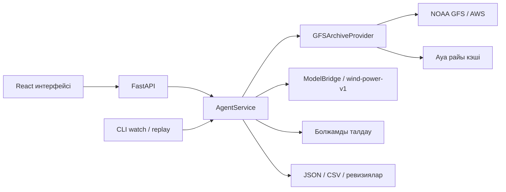

# JelAI — жел электр станциясының өндірісін болжауға арналған Agentic AI жүйесі

**Қазақша** · [Русский](README.ru.md) · [English](README.en.md)

**HackAlem AI · «Энергетика» трегі · «Самұрық-Қазына» кейсі.**

**Жоба атауы — JelAI.** ТЗ-дағы кейс атауы — «ЖЭС өндірісін болжауға арналған Agentic AI».

JelAI атауы «жел» және AI сөздерінен құралған. Жоба екі жел турбинасының алдағы **24 немесе 48 сағаттағы нормаланған белсенді қуатын** болжайды.

## Қысқаша сипаттама

Жел электр станциясының өндірісі ауа райына тәуелді. JelAI операторға немесе энергетика талдаушысына белгілі бір уақыт сәтінде қолжетімді болған ауа райы болжамын пайдаланып, сағаттық өндіріс болжамын алуға және оның қай деректерден есептелгенін тексеруге мүмкіндік береді.

Жоба 2026 жылғы ақпанды тарихи режимде қайта есептеуге арналған: агент NOAA GFS архивінен ауа райын алады, уақыттық шектеулерді тексереді, сақталған ML моделін іске қосады және нәтижені график, кесте, CSV мен тексерілетін метадеректер арқылы ұсынады. Нәтиженің өлшем бірлігі — `normalized_power`; оны МВт немесе МВт·сағ деп түсіндіруге болмайды.

## Не іске асырылды

- **24/48 сағаттық болжам:** екі турбинаны бірге немесе әрқайсысын бөлек таңдау.
- **Үштілді веб-интерфейс:** қазақша, орысша, ағылшынша; тіл таңдауы браузерде сақталады. График, сағаттық кесте, UTC/Алматы уақыт белдеуі және CSV жүктеу бар.
- **Нақты архивтік ауа райы:** NOAA GFS жүктеу, жергілікті кэш, SHA256 бақылау қосындылары және дереккөз метадеректері.
- **Агенттің толық циклі:** ауа райын алу → деректерді тексеру → модель → нәтижені талдау → сақтау. Кезеңдер мен қателер журналға жазылады.
- **Агент талдауы:** минимум, максимум, орташа мән, сағаттар арасындағы ең үлкен өзгеріс, жел жылдамдығының аралығы, тұрақты болжамды белгілеу және ревизияларды салыстыру. Ұсыныс болжамның сандық мәндерін өзгертпейді.
- **Ревизиялар:** бірдей кіріс үшін ID мен ревизия сақталады; өзгерген, уақыт талабына сай кіріс жаңа ревизия туғызады.
- **Автоматты жаңарту:** CLI-дегі `watch` режимі деректерді берілген аралықпен қайта тексереді; қайталау, қате кезіндегі кідіріс және бір процесс иелігін бекіту қарастырылған.
- **Модельді бағалау:** tuning, тәуелсіз holdout және соңғы қайта оқытылған модель бөлек көрсетіледі; есептің модель пакетімен байланысы тексеріледі.
- **Дайын ақпан нәтижесі:** 29 шығарылым, толық 48 сағаттық болжамдарда 2 784 жазба; ақпанға таңдалған **1 344 жазба, әр турбинаға 672 сағат**, өткізіп алған сағат жоқ. Бұл нәтиже [репозиторийдегі тексеру хаттамасында](docs/evidence/february-replay.json) тіркелген.

Дайын файлдар: [ақпан болжамы, CSV](outputs/forecast/february-2026-48h.csv) · [ақпан болжамы, JSON](outputs/forecast/february-2026-48h.json).

## Шешім қалай жұмыс істейді

1. Пайдаланушы **API** режимін, болжам шығарылатын күн мен UTC уақытын, турбиналарды және 24/48 сағаттық аралықты таңдайды.
2. FastAPI есептеу тапсырмасын қабылдап, `run_id` қайтарады. Интерфейс орындалу күйін сұрап отырады.
3. Агент турбиналардың координаталары бойынша GFS архивінен сол шығарылым сәтіне дейін қолжетімді болған ауа райын таңдайды. Кейін қолжетімді болған дерек тарихи болжамға кірмейді.
4. Деректер мен оқыту шегі тексеріліп, дайын `wind-power-v1` моделі әр турбинаға сағаттық болжам есептейді. Әр сұрауда модель қайта оқытылмайды.
5. Агент болжамды талдап, есепті, ескертулерді және ревизияны сақтайды. Интерфейс графикті, кестені, агент талдауын, дереккөзді және модель бағасын көрсетеді.
6. Пайдаланушы CSV жүктей алады. Интерфейс экспорттың көрсетілген JSON нәтижесіне сәйкестігін тексереді.

`valid_time` — бір сағаттық аралықтың **соңы**. Мысалы, `19:00 UTC` мәні `[18:00, 19:00)` аралығындағы орташа қуатқа қатысты; бірінші болжам қадамы — `+1 сағат`.

## Технологиялар

| Қабат | Репозиторийде қолданылған технологиялар |
| --- | --- |
| Backend және агент | Python 3.11, FastAPI, Pydantic, Uvicorn, HTTPX |
| Деректер мен ML | pandas, NumPy, SciPy, scikit-learn, joblib |
| Негізгі ML моделі | Әр турбинаға жеке histogram gradient boosting моделі, таңдалған конфигурация — `hgb_medium` |
| Салыстыру модельдері | Орташа тұрақты мән және жел жылдамдығына негізделген `wind_curve` |
| Негізгі интерфейс | TypeScript, React, Vite, Recharts, Lucide React |
| Балама интерфейс | Streamlit, Plotly |
| Ауа райын өңдеу | ECMWF ecCodes, NOAA GFS 0.25° архиві, AWS Open Data |
| Тексеру | pytest, Ruff, Vitest, Testing Library; GitHub Actions workflow конфигурациясы |

Тәуелділіктер [pyproject.toml](pyproject.toml), [ui/requirements.txt](ui/requirements.txt), [package.json](ui/web/package.json) және [package-lock.json](ui/web/package-lock.json) файлдарында көрсетілген.

**OpenAI немесе басқа LLM API-і ағымдағы сандық оқыту мен болжамға қатыспайды. API кілті және ақылы жазылым қажет емес.** Агенттің талдауы мен келесі әрекет ұсынысы кодтағы ережелер арқылы есептеледі.

## Жоба архитектурасы



| Орналасуы | Міндеті |
| --- | --- |
| `src/wind_agent/data/` | Бастапқы SCADA файлдарын тексеру, толық сағаттық оқыту деректерін дайындау |
| `src/wind_agent/weather/` | Архивтік ауа райын таңдау, жүктеу және тексеру |
| `src/wind_agent/model/`, `src/wind_agent/evaluation/` | ML моделі, эксперименттер, уақыт бойынша бағалау |
| `src/wind_agent/agent/` | Оркестрация, талдау, автоматты жаңарту, сақтау және ревизиялар |
| `src/wind_agent/api/`, `src/wind_agent/cli.py` | HTTP API және командалық интерфейс |
| `ui/web/` | Негізгі JelAI React интерфейсі |
| `ui/app.py` | Балама Streamlit интерфейсі |
| `models/wind-power-v1/` | Дайын салмақтар, метадеректер және бағалау есебі |
| `config/`, `outputs/forecast/`, `docs/evidence/` | Конфигурациялар, дайын нәтижелер және тексеру хаттамалары |

Жергілікті есептеулер мен кэш `artifacts/` каталогына жазылады; ол Git-ке кірмейді. Негізгі API `artifacts/live` каталогын пайдаланады. Бір артефакт каталогымен бір ғана backend процессі жұмыс істеуі керек.

## Орнату және іске қосу

### 1. Қажетті орта және репозиторий

Git, **Python 3.11**, **Node.js 24.14.0** және **npm 11.9.0** қолданыңыз. Орнатуға және нақты ауа райын алғаш жүктеуге интернет керек. Қайта оқыту негізгі демонстрация үшін қажет емес: дайын модель репозиторийде бар.

```sh
git clone https://github.com/BAITC-Hacks/hack-7ea5e17b-edubridge.git
cd hack-7ea5e17b-edubridge
```

### 2. Backend — бірінші терминал

Репозиторий түбірінде, **macOS/Linux**:

```sh
python3.11 -m venv .venv
.venv/bin/python -m pip install -e '.[dev,weather,model]' -r ui/requirements.txt
.venv/bin/python -m wind_agent --config config/archive-model.json serve
```

**Windows PowerShell** үшін баламасы:

```powershell
py -3.11 -m venv .venv
.\.venv\Scripts\python.exe -m pip install -e ".[dev,weather,model]" -r ui/requirements.txt
.\.venv\Scripts\python.exe -m wind_agent --config config/archive-model.json serve
```

Виртуалды ортаны белсендіру міндетті емес. `weather` қосымшасы ecCodes-ты, `model` модель тәуелділіктерін, `dev` тест құралдарын орнатады; `ui/requirements.txt` балама интерфейс пен оның тесттеріне керек.

- API: <http://127.0.0.1:8000>
- Қызмет күйі: <http://127.0.0.1:8000/health>
- Swagger: <http://127.0.0.1:8000/docs>

### 3. Негізгі React интерфейсі — екінші терминал

Жаңа терминалда репозиторий түбірінен:

```sh
cd ui/web
npm ci
npm run dev
```

Сайт: **<http://127.0.0.1:5173>**. Әдепкі тіл — орысша; жоғарғы панельден **Қазақша** таңдауға болады.

**Жылдам демо:** тек интерфейсті тексеру үшін 2-қадамды өткізіп, 1 және 3-қадамдарды орындаңыз. Әдепкі **Демо** режимі backend-сіз синтетикалық деректермен жұмыс істейді. Ол нақты модель нәтижесі немесе дәлдік көрсеткіші емес. Нақты болжам үшін backend-ті қосып, **API** режиміне ауысыңыз.

`/api` сұрауларын Vite `http://127.0.0.1:8000` адресіне бағыттайды. API порты өзгеше болса, `ui/web/.env.local` файлына, мысалы, `WIND_API_TARGET=http://127.0.0.1:8001` жазып, Vite-ты қайта қосыңыз. Таңдалған порт бос болуы керек. Сервистерді тоқтату — әр терминалда `Ctrl+C`.

### 4. Қосымша іске қосу режимдері

Төмендегі Python командалары репозиторий түбірінен орындалады. Windows-та `.venv/bin/python` орнына `.\.venv\Scripts\python.exe` пайдаланыңыз.

**Автоматты тарихи жаңартуды көрсету:** агент екі тарихи шығарылымды өзі ретімен есептейді, тәуліктің өтуін күтпейді.

```sh
.venv/bin/python -m wind_agent --config config/monitor-model.json watch --start-issue 2026-01-31T18:00:00Z --end-issue 2026-02-01T18:00:00Z --step-hours 24 --horizon-hours 48
```

Үздіксіз режим: `watch --interval-seconds 60`. `watch` бөлек `monitor-jobs` каталогын қолданады. Уақыт күйі сақталатындықтан, бұрынғы тарихи уақытқа оралу үшін бөлек `artifact_dir` қажет. Толық нұсқаулық: [автоматты жаңарту](docs/agent-monitor.md).

**Ақпанды толық қайта есептеу:** дайын CSV-ді қарау үшін бұл ұзақ қадамды орындау міндетті емес. Кэшсіз жүктеу бірнеше GB орын мен трафикті талап етеді.

```sh
.venv/bin/python -m wind_agent --config config/replay-february.json replay --horizon-hours 48
```

Бұл конфигурация API-ден бөлек сақтау каталогын қолданады. Нәтиже: `artifacts/february-integration/archive/replay/2026-02-48h/report.json` және `february.json`. Аудит пен CSV/JSON экспортын қайта жасау: [replay нұсқаулығы](docs/replay-validation.md).

**Балама Streamlit интерфейсі:** React/API процестерін тоқтатқаннан кейін `.venv/bin/python scripts/run_app.py` орындауға болады. Бұл команда API мен Streamlit-ті бірге іске қосады; интерфейс адресі — <http://127.0.0.1:8501>. Ол React интерфейсін іске қоспайды.

## Шешімді қалай тексеруге болады

### Қазыларға арналған негізгі сценарий

1. Жоғарыдағы нұсқаулықпен backend пен React-ты іске қосыңыз. <http://127.0.0.1:5173> адресін ашып, **Қазақша → API** таңдаңыз.
2. **Қосылым баптаулары** ішінде `/api` адресін қалдырып, **Тексеру** батырмасын басыңыз. `/health` жауабында `mode=archive`, `is_demo=false`, `model_ready=true`, `weather_ready=true` күтіледі.
3. **Шығарылым күні:** `2026-01-31`; **Уақыт, UTC:** `18:00`; **Турбиналар:** «Екі турбина»; **Болжам аралығы:** `48 сағ`.
4. **Болжамды есептеу** батырмасын басыңыз. Бірінші сұрауда ауа райы жүктеледі, сондықтан бірнеше минут кетуі мүмкін. Аяқталған күй — `completed` / «Есептеу аяқталды».
5. **96 мән** күтіледі: 48 сағат × 2 турбина. Уақыт аралығы — `2026-01-31T19:00:00Z` … `2026-02-02T18:00:00Z`; өлшем бірлігі — `normalized_power`. График пен кестедегі толымдылық модель дәлдігін білдірмейді.
6. **Дереккөз және сапа**, **Модельді бағалау**, **Агент талдауы** бөлімдерін қараңыз. GFS шығарылымы, модель нұсқасы, оқыту шегі және ескертулер көрсетіледі. `review_required` ұсынысы кіріс жорамалдарына байланысты болуы мүмкін; ол есептеу қатесі деген сөз емес.
7. **CSV жүктеп алу** арқылы нәтижені сақтаңыз. Тілді өзгерткенде есептелген нәтиже сақталатынын тексеріңіз.
8. Бірдей параметрлермен қайта іске қосқанда, кіріс өзгермесе, ID мен ревизия сақталады. `24 сағ` және бір турбинаны таңдағанда **24 жазба** күтіледі.

Ауа райы немесе модель қолжетімсіз болса, API қате қайтарады; жүйе нақты болжамның орнына жасырын демо не нөлдер қоспайды. Алғашқы тексеруге жоғарыдағы дәл уақытты қолданыңыз: дайын модельдің оқыту шегі одан ертерек шығарылымға жол бермейді.

### API арқылы тексеру

Swagger ішіндегі `POST /runs` әдісіне мына JSON-ды жіберіңіз:

```json
{
  "issue_time": "2026-01-31T18:00:00Z",
  "horizon_hours": 48,
  "turbine_ids": ["turbine_1", "turbine_2"]
}
```

| Сұрау | Күтілетін қызметі |
| --- | --- |
| `POST /runs` | `202` және `run_id`; есептеу фонда орындалады |
| `GET /runs/{run_id}` | Күй, ревизия және журнал; `completed` болғанша тексеріңіз |
| `GET /runs/{run_id}/forecast` | Сағаттық болжамның JSON жазбалары |
| `GET /runs/{run_id}/forecast.csv` | Сол болжамның CSV нұсқасы |
| `GET /runs/{run_id}/analysis` | Ағымдағы ревизияның агент талдауы |
| `GET /evaluation` | Дайын модель пакетімен байланыстырылған бағалау есебі |

[API келісімі](docs/api-contract.md) · [Модель бағалау API-і](docs/evaluation-api.md) · [Агент талдауы](docs/forecast-analysis.md).

### Автоматты тесттер

Backend тесттері, репозиторий түбірінен:

```sh
.venv/bin/python -m pytest -q
.venv/bin/python -m pip check
```

Frontend тесттері мен жинағы, бөлек терминалда репозиторий түбірінен:

```sh
cd ui/web
npm test
npm run build
```

Жиналған интерфейсті `ui/web` ішінен `npm run preview` арқылы <http://127.0.0.1:4173> адресінде ашуға болады.

Нақты HTTP/модель интеграциясын бөлек тексеру:

```sh
.venv/bin/python scripts/verify_app_integration.py --base-url http://127.0.0.1:8000 --timeout-seconds 300
```

Бұл тексеріс екі турбина мен 24/48 сағаттың алты комбинациясын, қайталануды және JSON/CSV сәйкестігін тексереді. Backend іске қосулы болуы керек; кэш жоқ болса, желі қолданылады.

Репозиторийдегі тексеру дәлелдері: [backend және monitor](docs/evidence/agent-platform-checks.json), [React және нақты API](docs/evidence/agent-ui-validation.json), [ақпан replay](docs/evidence/february-replay.json). Бұл файлдардағы сандар — сол хаттамалардағы тексеру нәтижелері; жаңа ортадағы нәтижені жоғарыдағы командалар береді. GitHub Actions конфигурациясы бар, бірақ [сақталған хаттамада](docs/evidence/agent-platform-checks.json) billing мәселесінен CI іске қосылмағаны көрсетілген; оны сәтті CI ретінде ұсынбаймыз.

## Деректер және интеграциялар

**Тарихи SCADA:** ұйымдастырушы берген [1-турбина CSV-і](https://drive.google.com/file/d/1hubNF3tgc7DbgXxHLpIF6zIBHtvMyzLX/view) және [2-турбина CSV-і](https://drive.google.com/file/d/1_WTrYhZ3-71A9IpkBb9RHPN7ncVaupBk/view). Түпнұсқа файлдар Git-ке қосылмаған; жүктеуші оларды бекітілген SHA256 бойынша тексереді. Алты толық 10 минуттық өлшемнің орташа мәні бір сағаттық оқыту нысанасын құрайды. Толық емес сағаттар нөлмен толтырылмайды. Деректерді дайындау: [DATA_PREPARATION.md](docs/DATA_PREPARATION.md).

**Ауа райы:** NOAA GFS 0.25° архиві AWS Open Data арқылы алынады. Модель кірісі — 100 м биіктіктегі жел жылдамдығы және 2 м биіктіктегі температура. Өлшенген болашақ SCADA ауа райы архивтік болжамның орнына қолданылмайды. Шығарылым сәтіне қолжетімділікті бағалау барлық қажетті GRIB және индекс объектілерінің S3 `LastModified` метадеректеріне сүйенеді. Дереккөз саясаты: [weather-source.md](docs/weather-source.md).

**Модель:** салмақтар мен метадеректер [models/wind-power-v1/](models/wind-power-v1/) ішінде. Болжам алу үшін бастапқы SCADA-ны қайта жүктеу немесе модельді қайта оқыту қажет емес. Оқытуды толық қайталау: [MODEL_REPRODUCIBILITY.md](docs/MODEL_REPRODUCIBILITY.md).

**Бағалау нәтижесі:** төмендегі қателер `normalized_power` бірлігінде; аз болғаны жақсы.

| Модель | Tuning MAE | Тәуелсіз holdout MAE |
| --- | ---: | ---: |
| Таңдалған `hgb_medium` | 0.232464 | 0.226919 |
| Қарапайым `wind_curve` | 0.248695 | 0.209460 |

Holdout кезеңінде қарапайым жел қисығының қатесі төмен. Модель алдын ала белгіленген tuning критерийімен таңдалған; holdout нәтижесі бойынша жеңімпаз қайта таңдалмаған. Толық дәлел: [модель сипаттамасы](docs/model-card.md), [validation.json](models/wind-power-v1/validation.json).

## Шектеулер

- **Ақпанның нақты өндіріс деректері жоқ.** Ақпанды толық есептеу оның болжам дәлдігін дәлелдемейді; ақпан MAE/RMSE мәндері берілмейді.
- **Қуатты нормалау формуласы мен турбиналардың атаулы қуаты расталмаған.** Нәтижелер МВт/МВт·сағ-қа ауыстырылмайды және станция қуаты ретінде қосылмайды.
- **SCADA уақыт шарттары — жорамал:** тұрақты UTC+5, 10 минуттық аралықтың басына қойылған белгі және нөлдік жариялау кідірісі. Бұларды дерек иесі растауы қажет.
- **Қаңтардағы holdout соңғы өндірістік модельдің тәуелсіз бағасы емес.** Соңғы модель қаңтар деректерімен, соның ішінде holdout-пен қайта оқытылған; оның cutoff-ы — `2026-01-31T18:00:00Z`.
- **GFS кеңістіктік дәлдігі шектеулі:** екі турбина да бір `43.75, 78.5` тор ұяшығына түседі. Сағат соңындағы ауа райы мәні сағаттық орташа қуатты болжауға пайдаланылады.
- **Архивтің қолжетімділік саясаты NOAA-ның бастапқы жариялау уақытын толық дәлелдемейді.** Бүгінгі жүктеу уақыты тарихи қолжетімділік ретінде қолданылмайды.
- **Калибрленген сенімділік интервалдары жоқ.** Жөндеу, мәжбүрлі шектеу және тоқтау режимдері жеке модельденбейді. Агент ұсыныстары жабдықты автоматты басқармайды.
- **Ұзақ мерзімді үздіксіз жұмыс дәлелденбеген.** Monitor-дың тарихи тексерісі жылдамдатылған уақытпен орындалған; болашақ маусымдардағы сапаға кепілдік бермейді.
- **Ағымдағы нұсқа жергілікті демонстрацияға арналған:** пайдаланушы авторизациясы мен рөлдік қолжетімділік іске асырылмаған. Белгісіз сервистік диагностикалар және бастапқы JSON/CSV техникалық өрістері түпнұсқа тілінде қалуы мүмкін.

## Deployed-нұсқаға сілтеме

**Репозиторийде жария орналастырылған нұсқаның URL-ы көрсетілмеген.** Қазыларға арналған тексеру жолы — GitHub-тан клондап, жергілікті іске қосу.

Жергілікті негізгі интерфейс: <http://127.0.0.1:5173>. Бұл интернетте жарияланған сайт емес. Болашақта `ui/web/dist` орналастырылса, HTTPS және `/api` → backend бағыты бөлек бапталуы керек; Vite-тың dev/preview proxy-і статикалық жинаққа кірмейді.
