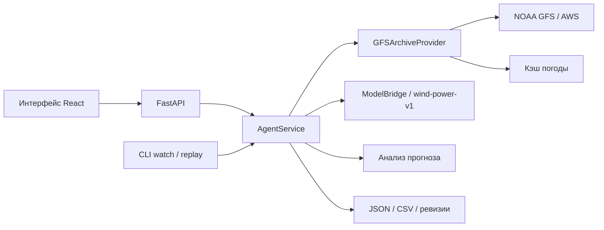

# JelAI — Agentic AI для прогнозирования выработки ВЭС

[Қазақша](README.md) · **Русский** · [English](README.en.md)

**HackAlem AI · трек «Энергетика» · кейс «Самрук-Казына».**

**Название проекта — JelAI.** Название кейса в ТЗ — «Agentic AI для прогнозирования выработки ВЭС».

Название JelAI образовано от казахского «жел» (ветер) и AI. Проект прогнозирует **нормализованную активную мощность двух ветровых турбин на следующие 24 или 48 часов**.

## Краткое описание

Выработка ветроэлектростанции зависит от погоды. JelAI позволяет оператору или энергетику-аналитику получить почасовой прогноз выработки на основе прогноза погоды, доступного в определённый момент времени, и проверить, по каким данным он рассчитан.

Проект предназначен для исторического пересчёта февраля 2026 года: агент получает погоду из архива NOAA GFS, проверяет временные ограничения, запускает сохранённую ML-модель и представляет результат в виде графика, таблицы, CSV и проверяемых метаданных. Единица результата — `normalized_power`; её нельзя интерпретировать как МВт или МВт·ч.

## Что реализовано

- **Прогноз на 24/48 часов:** выбор двух турбин вместе или каждой отдельно.
- **Веб-интерфейс на трёх языках:** казахский, русский, английский; выбор языка сохраняется в браузере. Доступны график, почасовая таблица, часовой пояс UTC/Алматы и скачивание CSV.
- **Реальная архивная погода:** загрузка NOAA GFS, локальный кэш, контрольные суммы SHA256 и метаданные источника.
- **Полный цикл агента:** получение погоды → проверка данных → модель → анализ результата → сохранение. Этапы и ошибки записываются в журнал.
- **Анализ агента:** минимум, максимум, среднее, наибольшее изменение между часами, диапазон скорости ветра, отметка постоянного прогноза и сравнение ревизий. Рекомендация не изменяет численные значения прогноза.
- **Ревизии:** при одинаковых входах сохраняются ID и ревизия; изменившиеся входы, соответствующие временным требованиям, создают новую ревизию.
- **Автоматическое обновление:** режим CLI `watch` повторно проверяет данные с заданным интервалом; предусмотрены повторы, задержка при ошибках и закрепление владения за одним процессом.
- **Оценка модели:** tuning, независимый holdout и итоговая переобученная модель показаны отдельно; проверяется связь отчёта с пакетом модели.
- **Готовый результат за февраль:** 29 выпусков, 2 784 записи в полных прогнозах на 48 часов; для февраля выбраны **1 344 записи, по 672 часа на турбину**, пропущенных часов нет. Результат зафиксирован в [протоколе проверки в репозитории](docs/evidence/february-replay.json).

Готовые файлы: [прогноз за февраль, CSV](outputs/forecast/february-2026-48h.csv) · [прогноз за февраль, JSON](outputs/forecast/february-2026-48h.json).

## Как работает решение

1. Пользователь выбирает режим **API**, дату и время выпуска прогноза в UTC, турбины и горизонт 24/48 часов.
2. FastAPI принимает задачу расчёта и возвращает `run_id`. Интерфейс опрашивает состояние выполнения.
3. По координатам турбин агент выбирает из архива GFS погоду, доступную к моменту выпуска. Данные, ставшие доступными позднее, не попадают в исторический прогноз.
4. После проверки данных и границы обучения готовая модель `wind-power-v1` рассчитывает почасовой прогноз для каждой турбины. Модель не переобучается при каждом запросе.
5. Агент анализирует прогноз, сохраняет отчёт, предупреждения и ревизию. Интерфейс показывает график, таблицу, анализ агента, источник данных и оценку модели.
6. Пользователь может скачать CSV. Интерфейс проверяет соответствие экспорта отображаемому результату JSON.

`valid_time` — **конец** часового интервала. Например, значение `19:00 UTC` относится к средней мощности за интервал `[18:00, 19:00)`; первый шаг прогноза — `+1 час`.

## Технологии

| Слой | Технологии, используемые в репозитории |
| --- | --- |
| Backend и агент | Python 3.11, FastAPI, Pydantic, Uvicorn, HTTPX |
| Данные и ML | pandas, NumPy, SciPy, scikit-learn, joblib |
| Основная ML-модель | Отдельная модель histogram gradient boosting для каждой турбины, выбранная конфигурация — `hgb_medium` |
| Модели сравнения | Постоянное среднее значение и `wind_curve` на основе скорости ветра |
| Основной интерфейс | TypeScript, React, Vite, Recharts, Lucide React |
| Альтернативный интерфейс | Streamlit, Plotly |
| Обработка погоды | ECMWF ecCodes, архив NOAA GFS 0.25°, AWS Open Data |
| Проверки | pytest, Ruff, Vitest, Testing Library; конфигурация workflow GitHub Actions |

Зависимости указаны в [pyproject.toml](pyproject.toml), [ui/requirements.txt](ui/requirements.txt), [package.json](ui/web/package.json) и [package-lock.json](ui/web/package-lock.json).

**OpenAI или другой LLM API не участвует в текущем численном обучении и прогнозировании. API-ключ и платная подписка не нужны.** Анализ агента и рекомендация следующего действия рассчитываются по правилам в коде.

## Архитектура проекта



| Расположение | Назначение |
| --- | --- |
| `src/wind_agent/data/` | Проверка исходных файлов SCADA, подготовка полных часовых данных для обучения |
| `src/wind_agent/weather/` | Выбор, загрузка и проверка архивной погоды |
| `src/wind_agent/model/`, `src/wind_agent/evaluation/` | ML-модель, эксперименты, временная оценка |
| `src/wind_agent/agent/` | Оркестрация, анализ, автоматическое обновление, хранение и ревизии |
| `src/wind_agent/api/`, `src/wind_agent/cli.py` | HTTP API и командный интерфейс |
| `ui/web/` | Основной React-интерфейс JelAI |
| `ui/app.py` | Альтернативный интерфейс Streamlit |
| `models/wind-power-v1/` | Готовые веса, метаданные и отчёт оценки |
| `config/`, `outputs/forecast/`, `docs/evidence/` | Конфигурации, готовые результаты и протоколы проверок |

Локальные расчёты и кэш записываются в каталог `artifacts/`; он не входит в Git. Основной API использует каталог `artifacts/live`. С одним каталогом артефактов должен работать только один процесс backend.

## Установка и запуск

### 1. Необходимое окружение и репозиторий

Используйте Git, **Python 3.11**, **Node.js 24.14.0** и **npm 11.9.0**. Для установки и первой загрузки реальной погоды нужен интернет. Для основной демонстрации переобучение не требуется: готовая модель есть в репозитории.

```sh
git clone https://github.com/BAITC-Hacks/hack-7ea5e17b-edubridge.git
cd hack-7ea5e17b-edubridge
```

### 2. Backend — первый терминал

Из корня репозитория, **macOS/Linux**:

```sh
python3.11 -m venv .venv
.venv/bin/python -m pip install -e '.[dev,weather,model]' -r ui/requirements.txt
.venv/bin/python -m wind_agent --config config/archive-model.json serve
```

Эквивалент для **Windows PowerShell**:

```powershell
py -3.11 -m venv .venv
.\.venv\Scripts\python.exe -m pip install -e ".[dev,weather,model]" -r ui/requirements.txt
.\.venv\Scripts\python.exe -m wind_agent --config config/archive-model.json serve
```

Активация виртуального окружения необязательна. Дополнение `weather` устанавливает ecCodes, `model` — зависимости модели, `dev` — инструменты тестирования; `ui/requirements.txt` нужен для альтернативного интерфейса и его тестов.

- API: <http://127.0.0.1:8000>
- Состояние сервиса: <http://127.0.0.1:8000/health>
- Swagger: <http://127.0.0.1:8000/docs>

### 3. Основной React-интерфейс — второй терминал

В новом терминале из корня репозитория:

```sh
cd ui/web
npm ci
npm run dev
```

Сайт: **<http://127.0.0.1:5173>**. Язык по умолчанию — русский; в верхней панели можно выбрать **Русский**.

**Быстрое демо:** чтобы проверить только интерфейс, пропустите шаг 2 и выполните шаги 1 и 3. Режим **Демо**, включённый по умолчанию, работает с синтетическими данными без backend. Это не результат реальной модели и не показатель точности. Для реального прогноза запустите backend и переключитесь в режим **API**.

Vite направляет запросы `/api` на адрес `http://127.0.0.1:8000`. Если API использует другой порт, запишите, например, `WIND_API_TARGET=http://127.0.0.1:8001` в файл `ui/web/.env.local` и перезапустите Vite. Выбранный порт должен быть свободен. Для остановки сервисов нажмите `Ctrl+C` в каждом терминале.

### 4. Дополнительные режимы запуска

Приведённые ниже команды Python выполняются из корня репозитория. В Windows используйте `.\.venv\Scripts\python.exe` вместо `.venv/bin/python`.

**Демонстрация автоматического исторического обновления:** агент последовательно рассчитывает два исторических выпуска, не ожидая, пока пройдут реальные сутки.

```sh
.venv/bin/python -m wind_agent --config config/monitor-model.json watch --start-issue 2026-01-31T18:00:00Z --end-issue 2026-02-01T18:00:00Z --step-hours 24 --horizon-hours 48
```

Непрерывный режим: `watch --interval-seconds 60`. `watch` использует отдельный каталог `monitor-jobs`. Поскольку временное состояние сохраняется, для возврата к более раннему историческому времени нужен отдельный `artifact_dir`. Подробная инструкция: [автоматическое обновление](docs/agent-monitor.md).

**Полный пересчёт февраля:** для просмотра готового CSV этот длительный шаг необязателен. Загрузка без кэша требует нескольких GB места и трафика.

```sh
.venv/bin/python -m wind_agent --config config/replay-february.json replay --horizon-hours 48
```

Эта конфигурация использует отдельный от API каталог хранения. Результат: `artifacts/february-integration/archive/replay/2026-02-48h/report.json` и `february.json`. Повторный аудит и экспорт CSV/JSON: [инструкция replay](docs/replay-validation.md).

**Альтернативный интерфейс Streamlit:** после остановки процессов React/API можно выполнить `.venv/bin/python scripts/run_app.py`. Эта команда запускает API и Streamlit вместе; адрес интерфейса — <http://127.0.0.1:8501>. Она не запускает React-интерфейс.

## Как проверить решение

### Основной сценарий для жюри

1. Запустите backend и React по инструкции выше. Откройте <http://127.0.0.1:5173> и выберите **Русский → API**.
2. В **Настройках подключения** оставьте адрес `/api` и нажмите **Проверить**. В ответе `/health` ожидаются `mode=archive`, `is_demo=false`, `model_ready=true`, `weather_ready=true`.
3. **Дата выпуска:** `2026-01-31`; **Время, UTC:** `18:00`; **Турбины:** «Обе турбины»; **Горизонт:** `48 ч`.
4. Нажмите **Рассчитать прогноз**. При первом запросе загружается погода, поэтому расчёт может занять несколько минут. Завершённое состояние — `completed` / «Расчёт завершён».
5. Ожидаются **96 значений**: 48 часов × 2 турбины. Временной диапазон — `2026-01-31T19:00:00Z` … `2026-02-02T18:00:00Z`; единица — `normalized_power`. Полнота графика и таблицы не означает точность модели.
6. Откройте разделы **Источник и качество**, **Оценка модели**, **Анализ агента**. В них показаны выпуск GFS, версия модели, граница обучения и предупреждения. Рекомендация `review_required` может быть связана с предположениями о входных данных; она не означает ошибку расчёта.
7. Сохраните результат кнопкой **Скачать CSV**. Проверьте, что рассчитанный результат сохраняется при смене языка.
8. При повторном запуске с теми же параметрами ID и ревизия сохраняются, если входы не изменились. При выборе `24 ч` и одной турбины ожидаются **24 записи**.

Если погода или модель недоступны, API возвращает ошибку; система не подставляет скрытое демо или нули вместо реального прогноза. Для первой проверки используйте точное время выше: граница обучения готовой модели не допускает более ранний выпуск.

### Проверка через API

Отправьте следующий JSON в метод `POST /runs` в Swagger:

```json
{
  "issue_time": "2026-01-31T18:00:00Z",
  "horizon_hours": 48,
  "turbine_ids": ["turbine_1", "turbine_2"]
}
```

| Запрос | Ожидаемая функция |
| --- | --- |
| `POST /runs` | `202` и `run_id`; расчёт выполняется в фоне |
| `GET /runs/{run_id}` | Состояние, ревизия и журнал; опрашивайте до `completed` |
| `GET /runs/{run_id}/forecast` | JSON-записи почасового прогноза |
| `GET /runs/{run_id}/forecast.csv` | CSV того же прогноза |
| `GET /runs/{run_id}/analysis` | Анализ агента для текущей ревизии |
| `GET /evaluation` | Отчёт оценки, связанный с готовым пакетом модели |

[Контракт API](docs/api-contract.md) · [API оценки модели](docs/evaluation-api.md) · [Анализ агента](docs/forecast-analysis.md).

### Автоматические тесты

Тесты backend, из корня репозитория:

```sh
.venv/bin/python -m pytest -q
.venv/bin/python -m pip check
```

Тесты и сборка frontend, в отдельном терминале из корня репозитория:

```sh
cd ui/web
npm test
npm run build
```

Собранный интерфейс можно открыть из `ui/web` командой `npm run preview` по адресу <http://127.0.0.1:4173>.

Отдельная проверка реальной интеграции HTTP и модели:

```sh
.venv/bin/python scripts/verify_app_integration.py --base-url http://127.0.0.1:8000 --timeout-seconds 300
```

Проверка охватывает шесть комбинаций двух турбин и горизонтов 24/48 часов, повторяемость и соответствие JSON/CSV. Backend должен быть запущен; при отсутствии кэша используется сеть.

Доказательства проверок в репозитории: [backend и monitor](docs/evidence/agent-platform-checks.json), [React и реальный API](docs/evidence/agent-ui-validation.json), [replay февраля](docs/evidence/february-replay.json). Числа в этих файлах — результаты проверок из соответствующих протоколов; результат в новом окружении дают команды выше. Конфигурация GitHub Actions есть, но в [сохранённом протоколе](docs/evidence/agent-platform-checks.json) указано, что CI не запустился из-за проблемы с billing; мы не представляем его как успешный CI.

## Данные и интеграции

**Историческая SCADA:** предоставленные организатором [CSV турбины 1](https://drive.google.com/file/d/1hubNF3tgc7DbgXxHLpIF6zIBHtvMyzLX/view) и [CSV турбины 2](https://drive.google.com/file/d/1_WTrYhZ3-71A9IpkBb9RHPN7ncVaupBk/view). Исходные файлы не добавлены в Git; загрузчик проверяет их по закреплённым SHA256. Среднее шести полных 10-минутных измерений образует часовую цель обучения. Неполные часы не заполняются нулями. Подготовка данных: [DATA_PREPARATION.md](docs/DATA_PREPARATION.md).

**Погода:** архив NOAA GFS 0.25° загружается через AWS Open Data. Входы модели — скорость ветра на высоте 100 м и температура на высоте 2 м. Измеренная будущая погода SCADA не используется вместо архивного прогноза. Оценка доступности к моменту выпуска опирается на метаданные S3 `LastModified` всех необходимых объектов GRIB и индексов. Политика источника: [weather-source.md](docs/weather-source.md).

**Модель:** веса и метаданные находятся в [models/wind-power-v1/](models/wind-power-v1/). Для получения прогноза не нужно заново загружать исходную SCADA или переобучать модель. Полное воспроизведение обучения: [MODEL_REPRODUCIBILITY.md](docs/MODEL_REPRODUCIBILITY.md).

**Результаты оценки:** ошибки ниже выражены в единицах `normalized_power`; меньше — лучше.

| Модель | Tuning MAE | Независимый holdout MAE |
| --- | ---: | ---: |
| Выбранная `hgb_medium` | 0.232464 | 0.226919 |
| Простая `wind_curve` | 0.248695 | 0.209460 |

На holdout ошибка простой ветровой кривой ниже. Модель выбрана по заранее заданному tuning-критерию; победитель не выбирался заново по результатам holdout. Полное обоснование: [описание модели](docs/model-card.md), [validation.json](models/wind-power-v1/validation.json).

## Ограничения

- **Фактической выработки за февраль нет.** Полный пересчёт февраля не доказывает точность прогноза; февральские MAE/RMSE не приводятся.
- **Формула нормализации мощности и номинальная мощность турбин не подтверждены.** Результаты не переводятся в МВт/МВт·ч и не суммируются как мощность станции.
- **Временные условия SCADA — предположения:** фиксированный UTC+5, метка начала 10-минутного интервала и нулевая задержка публикации. Их должен подтвердить владелец данных.
- **Январский holdout не является независимой оценкой итоговой production-модели.** Итоговая модель переобучена на январских данных, включая holdout; её cutoff — `2026-01-31T18:00:00Z`.
- **Пространственная точность GFS ограничена:** обе турбины попадают в одну ячейку сетки `43.75, 78.5`. Значение погоды на конец часа используется для прогноза средней часовой мощности.
- **Политика доступности архива не доказывает полностью исходное время публикации NOAA.** Сегодняшнее время загрузки не используется как историческая доступность.
- **Калиброванных доверительных интервалов нет.** Ремонт, принудительные ограничения и остановки отдельно не моделируются. Рекомендации агента не управляют оборудованием автоматически.
- **Длительная непрерывная работа не подтверждена.** Историческая проверка monitor выполнена с ускоренным временем; она не гарантирует качество в будущих сезонах.
- **Текущая версия предназначена для локальной демонстрации:** пользовательская авторизация и ролевой доступ не реализованы. Неизвестные сервисные диагностики и технические поля исходных JSON/CSV могут оставаться на языке оригинала.

## Ссылка на развёрнутую версию

**В репозитории не указан URL публично развёрнутой версии.** Путь проверки для жюри — клонирование из GitHub и локальный запуск.

Основной локальный интерфейс: <http://127.0.0.1:5173>. Это не опубликованный в интернете сайт. При будущем размещении `ui/web/dist` нужно отдельно настроить HTTPS и маршрут `/api` → backend; proxy Vite для dev/preview не входит в статическую сборку.
